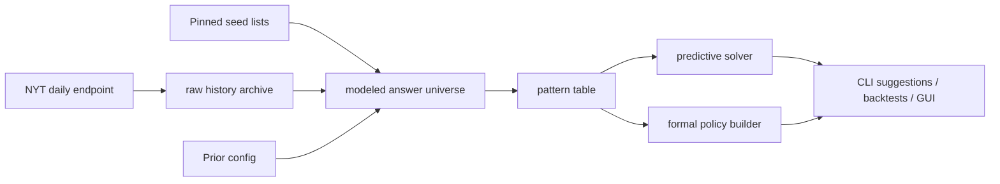

<div align="center">
  <h1>Maybe Wordle</h1>
  <p><strong>A Wordle solver for the NYT era where the answer list stopped behaving like a fixed museum exhibit.</strong></p>
  <p>
    
    
    
    
  </p>
</div>

> Classic Wordle solvers usually assume a fixed answer universe and a uniform prior.
> This project does not.
> It models modern NYT Wordle as a moving target: historical answers are fetched from the live daily endpoint, candidate answers are seeded from pinned community lists, and the app can switch between a fast predictive solver and a separate formal exact-policy builder over a pinned model.

## Why this repo exists

In February 2026, NYT started reusing past answers. That breaks a lot of old solver assumptions.

`maybe-wordle` is a Rust project built around three ideas:

- the answer set is modeled, not treated as divine truth
- the prior matters, because not all surviving answers are equally plausible
- "optimal" should mean optimal for a declared model, not "I guessed what the editor was thinking"

## What it does

| Mode | What it optimizes | Best use |
| --- | --- | --- |
| `predictive` | Weighted entropy with an exact-search fallback near the endgame | Fast everyday solving |
| `formal-optimal` | Exact expected guesses plus worst-case depth over a fixed formal model | Reproducible policy analysis |

Current commands:

```text
sync-data
build-model
build-optimal-policy
verify-optimal-policy
gui
add-manual
reconcile-seeds
merge-seeds
suggest
solve-interactive
explain-state
backtest
predictive-ablations
build-predictive-opener
build-predictive-replies
experiments
tune-prior
fit-proxy-weights
benchmark
```

## Quick start

```bash
cargo run -- sync-data
cargo run -- build-model
cargo run -- suggest --guess crane --feedback 00000 --top 5
cargo run -- solve-interactive
cargo run -- predictive-ablations --from 2026-02-08 --to 2026-03-09
```

Example predictive query from this repo's current tracked artifacts:

```text
> maybe-wordle suggest --guess crane --feedback 00000 --top 5 --mode predictive
mode=predictive date=2026-03-09 surviving=270 total_weight=186.7131
slipt entropy=5.66910 solve_prob=0.00000 expected_remaining=7.976
sluit entropy=5.61949 solve_prob=0.00000 expected_remaining=7.337
silty entropy=5.61485 solve_prob=0.00000 expected_remaining=8.089
spilt entropy=5.60952 solve_prob=0.00536 expected_remaining=7.914
smolt entropy=5.60760 solve_prob=0.00000 expected_remaining=6.855
```

## The shape of the system



## Modeling stance

- `G`: all allowed guesses from a pinned snapshot of `tabatkins/wordle-list`
- `A_seed`: a curated candidate-answer seed list checked into the repo
- `H`: historical NYT answers fetched by date from the official daily endpoint
- `A_model`: `A_seed U H U manual_additions`

The prior is configurable in [`config/prior.toml`](./config/prior.toml). The default setup gives seed answers full base weight, history-only outliers reduced base weight, and applies a cooldown-plus-recovery curve to recently used answers.

This is the central bet of the repo: after answer reuse started, the right solver is not just "faster entropy on the old list". It needs a stated worldview.

## Data sources

Seed lists are pinned in-repo for reproducibility:

- valid guesses: `tabatkins/wordle-list`
- candidate answers: `joshstephenson/Wordle-Solver`
- reference answer list: `LaurentLessard/wordlesolver`

Source metadata lives in [`data/seed/sources.toml`](./data/seed/sources.toml).

The historical archive is fetched from the NYT daily puzzle endpoint:

- `https://www.nytimes.com/svc/wordle/v2/YYYY-MM-DD.json`

## Formal mode

`formal-optimal` is stricter than predictive mode. It expects generated policy artifacts in `data/formal/<model>/`, including:

- `manifest.json`
- `state_values.bin`
- `policy_table.bin`
- `proof_metadata.json`
- `pattern_table.bin`
- `prior.toml`

Build them with:

```bash
cargo run --release -- build-optimal-policy --model formal-v1
cargo run --release -- verify-optimal-policy --model formal-v1
```

The formal build is intentionally offline-heavy. On the full pinned model it can take a long time to finish, and the manifest/policy files are written at the end of the run.

Formal artifacts are versioned. If the model inputs or serialized state format change, stale files are rejected and should be rebuilt.

If you only want fast suggestions, predictive mode works with the derived artifacts under [`data/derived`](./data/derived).

## Predictive experiments and books

Predictive mode now has a separate experiment and cache surface:

- `cargo run -- predictive-ablations --from YYYY-MM-DD --to YYYY-MM-DD`
- `cargo run -- build-predictive-opener --date YYYY-MM-DD`
- `cargo run -- build-predictive-replies --date YYYY-MM-DD`

The opener and reply caches are predictive-only artifacts under [`data/derived/predictive`](./data/derived/predictive). They are keyed by weight mode, model variant, date context, and a fingerprint of the current predictive config. If a cache is missing or stale, predictive mode falls back to live scoring automatically.

Predictive weighting can still heavily down-rank recently used answers, but eligible modeled answers are no longer dropped completely when their computed prior weight reaches zero. The live solver now keeps them with a tiny fallback weight so valid boards remain representable instead of collapsing to "no answers remain".

The GUI no longer recomputes suggestions on the UI thread. Heavy predictive or formal recomputes now run in a background worker, so `Suggest`, `Undo`, `Reset`, mode switches, and date changes stay responsive while results are pending.

## Quality bar

- duplicate-letter scoring is tested explicitly
- the formal solver has toy-universe consistency tests
- seed-list maintenance has regression coverage
- `cargo test` is green in the current repo state

A sample release benchmark from the current machine and checked-in predictive artifacts:

```text
mode=predictive runs=1 surviving=2350 pattern_table_bytes=34909250 average_ms=14.552
```

## Repo map

<details>
<summary>Open the project layout</summary>

```text
config/
  prior.toml
data/
  raw/        # NYT history archive
  seed/       # pinned guess and answer seeds
  derived/    # modeled answers and predictive pattern table
  formal/     # exact-policy artifacts by model id
src/
  data.rs
  model.rs
  formal.rs
  solver.rs
  scoring.rs
  gui.rs
tests/
PLAN.md
```

</details>

## If you want to poke at it

```bash
cargo test
cargo run -- backtest
cargo run -- experiments
cargo run -- gui
```

If you want the longer design rationale, the planning notes are in [`PLAN.md`](./PLAN.md).
