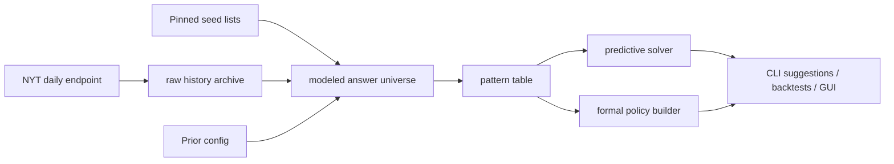

<div align="center">
  <h1>Maybe Wordle</h1>
  <p><strong>A Wordle solver for the NYT era where the answer list stopped behaving like a fixed museum exhibit.</strong></p>
  <p>
    
    
    
    
  </p>
</div>

> Classic Wordle solvers usually assume a fixed answer universe and a uniform prior.
> This project does not.
> It models modern NYT Wordle as a moving target: historical answers are fetched from the live daily endpoint, candidate answers are seeded from pinned community lists, and the app can switch between a fast heuristic predictive solver and a separately verified fixed-model policy builder.

## Why this repo exists

In February 2026, NYT started reusing past answers. That breaks a lot of old solver assumptions.

`maybe-wordle` is a Rust project built around three ideas:

- the answer set is modeled, not treated as divine truth
- the prior matters, because not all surviving answers are equally plausible
- "optimal" should mean optimal for a declared model, not "I guessed what the editor was thinking"

## What it does

| Mode | What it optimizes | Best use |
| --- | --- | --- |
| `predictive` | Heuristic weighted search with bounded candidate pools and deeper endgame search | Fast everyday solving, not calibrated editorial probabilities |
| `formal-optimal` | Lexicographic worst-case depth and expected guesses over one pinned model | Reproducible fixed-model policy analysis |

Current commands:

```text
sync-data
build-model
build-optimal-policy
verify-optimal-policy
gui
add-manual
reconcile-seeds
merge-seeds
suggest
solve-interactive
explain-state
backtest
predictive-ablations
evaluate-live-config
three-guess-gap
four-guess-openers
build-predictive-opener
build-predictive-replies
experiments
tune-prior
fit-proxy-weights
benchmark
```

## First run from scratch

If you cloned the repo and want a working baseline, run these in order:

```bash
cargo run -- sync-data
cargo run -- build-model
```

`sync-data` fetches the NYT daily JSON archive into `data/raw/nyt_daily_answers.jsonl`, one JSON row per puzzle date. On a fresh checkout this is usually the slowest step because it has to backfill history over the network.

Sync always retries missing dates, including old middle-of-archive gaps, and rechecks the configured recent window. HTTP `429` responses honor `Retry-After` with bounded retry delays. A partial sync never replaces a valid contiguous archive with a gapped one.

`build-model` turns that raw history into generated model CSVs under `data/derived/`. Model building, predictive artifact generation, and backtests reject non-contiguous history by default. `allow_history_gaps = true` in `config/prior.toml` is the explicit retrospective override. Generated history, CSV, pattern-table, predictive-book, and formal-policy files use durable sibling-temporary writes followed by atomic replacement.

Optional but useful after that:

```bash
cargo run -- build-predictive-opener --date YYYY-MM-DD
cargo run -- build-predictive-replies --date YYYY-MM-DD
cargo run --release -- build-optimal-policy --model formal-v1
```

Predictive opener/reply artifacts live under `data/derived/predictive/`. Their versioned identity hashes the ordered guesses, complete answer records, history snapshot, effective date weights, model variant, predictive policy, and config; same-count word substitutions or history mutations therefore invalidate stale books.

Formal artifacts live under `data/formal/<model>/`. They are the heaviest build in the repo and are only needed if you want exact-policy analysis.

Common first-run failures:

- missing seed files or an incomplete checkout under `data/seed/`
- no synced NYT history yet, so the requested date is outside the known range
- predictive artifacts missing or stale for the date you asked for, so the solver uses normal live ranking without artifact promotion unless you explicitly pass `--live-fallback`
- `formal-optimal` selected before `build-optimal-policy` has generated the complete matching `data/formal/<model>/` file set

## Quick start

```bash
cargo run -- sync-data
cargo run -- build-model
cargo run -- gui
cargo run -- suggest --guess crane --feedback 00000 --top 5 --date 2026-03-09
cargo run -- solve-interactive
```

`cargo run` with no arguments also opens the GUI.

Example predictive query shape from the current local model data:

```text
> maybe-wordle suggest --guess crane --feedback 00000 --top 5 --mode predictive --date 2026-03-09
warning: predictive artifact unavailable for this state; disk-only mode will use live ranking without promotion
warning: reply-book artifact is missing for this date or branch; branch suggestions are coming from live evaluation
mode=predictive model=<policy> manifest=<hash> history_snapshot=<date> history_hash=<hash> artifact_status=<status> promoted_from_cache=<bool> date=2026-03-09 surviving=<count> total_weight=<weight>
<word> entropy=<bits> solve_prob=<probability> expected_remaining=<count>
```

## The shape of the system


```mermaid
flowchart LR
    A["NYT daily endpoint"] --> B["raw history archive"]
    C["Pinned seed lists"] --> D["modeled answer universe"]
    B --> D
    E["Prior config"] --> D
    D --> F["pattern table"]
    F --> G["predictive solver"]
    F --> H["formal policy builder"]
    G --> I["CLI suggestions / backtests / GUI"]
    H --> I
```

## Modeling stance

- `G`: all allowed guesses from a pinned snapshot of `tabatkins/wordle-list`
- `A_seed`: a curated candidate-answer seed list checked into the repo
- `H`: historical NYT answers fetched by date from the official daily endpoint
- `A_model`: `A_seed U H U manual_additions`

The prior is configurable in [`config/prior.toml`](./config/prior.toml). The default setup gives seed answers full base weight, history-only outliers reduced base weight, and applies a cooldown-plus-recovery curve to recently used answers.

This is the central bet of the repo: after answer reuse started, the right solver is not just "faster entropy on the old list". It needs a stated worldview.

## Data sources

Seed lists are pinned in-repo for reproducibility:

- valid guesses: `tabatkins/wordle-list`
- candidate answers: `joshstephenson/Wordle-Solver`
- reference answer list: `LaurentLessard/wordlesolver`

Source metadata lives in [`data/seed/sources.toml`](./data/seed/sources.toml).

The historical archive is fetched from the NYT daily puzzle endpoint:

- `https://www.nytimes.com/svc/wordle/v2/YYYY-MM-DD.json`

## Formal mode

`formal-optimal` is a fixed-model analysis mode, not a prediction of NYT editorial choices. It expects generated policy artifacts in `data/formal/<model>/`, including:

- `manifest.json`
- `state_values.bin`
- `policy_table.bin`
- `proof_metadata.json`
- `proof_certificate.json`
- `small_state_table.json`
- `pattern_table.bin`
- `prior.toml`

Build them with:

```bash
cargo run --release -- build-optimal-policy --model formal-v1
cargo run --release -- verify-optimal-policy --model formal-v1
```

The formal build is intentionally offline-heavy. Refinement pruning is disabled because its former dominance direction was not valid for the lexicographic objective. Verification starts with an empty independent solver cache, requires certificate coverage for every persisted state, recomputes every claimed feedback partition, child state, and probability mass from the pattern table, and independently resolves every policy decision. Deleting a state or changing a pattern, child, mass, objective, or decision fails verification.

The checked-in `data/formal/formal-v1/` directory may contain seed inputs such as `prior.toml` or `pattern_table.bin`, but it is not a usable formal policy until `build-optimal-policy` has generated the complete matching artifact set. Certificate format version 4 invalidates older formal outputs.

Formal artifacts are versioned. If the model inputs or serialized state format change, stale files are rejected and should be rebuilt.

If you only want fast suggestions, predictive mode works with the derived artifacts under [`data/derived`](./data/derived).

## Data layout

- [`data/raw`](./data/raw) stores the fetched NYT daily JSON archive as `nyt_daily_answers.jsonl`.
- [`data/derived`](./data/derived) stores generated modeled answers, the pattern table, and other shared derived outputs.
- [`data/derived/predictive`](./data/derived/predictive) stores generated predictive opener and reply caches.
- [`data/formal`](./data/formal) stores exact-policy artifacts by model id.

## Predictive experiments and books

Predictive mode now has a separate experiment and cache surface:

- `cargo run -- predictive-ablations --from YYYY-MM-DD --to YYYY-MM-DD`
- `cargo run -- evaluate-live-config --config path/to/prior.toml --from YYYY-MM-DD --to YYYY-MM-DD`
- `cargo run -- three-guess-gap --from YYYY-MM-DD --to YYYY-MM-DD`
- `cargo run -- four-guess-openers --from YYYY-MM-DD --to YYYY-MM-DD --opener crane`
- `cargo run -- build-predictive-opener --date YYYY-MM-DD`
- `cargo run -- build-predictive-replies --date YYYY-MM-DD`

The opener and reply caches are predictive-only artifacts under [`data/derived/predictive`](./data/derived/predictive). Filenames and serialized identity include the predictive manifest version and full model-manifest hash.

Opener artifacts are date-specific. The predictive suggestion API now exposes three modes:

1. `LiveOnly`: no artifact or session promotion
2. `FastDiskOnly`: disk artifacts only
3. `Full`: disk artifacts plus live session fallback

For `Full` root suggestions the solver uses this fallback chain:

1. exact-date opener artifact
2. newest earlier opener artifact within 14 days
3. live session opener computation

For `FastDiskOnly`, step 3 is skipped. Reply-book artifacts still require an exact date/context match.

`build-predictive-opener` is heavier than ordinary suggestion commands: it evaluates a bounded opener pool on a recent 30-day window, tracks four-guess tails explicitly, and validates opener switches against a previous-window holdout. If you want fast predictive GUI/root suggestions for a specific date, build the opener artifact for that date ahead of time.

Predictive policy is now explicit and versioned. The config still loads from [`config/prior.toml`](./config/prior.toml), but the solver derives a named predictive policy from it and includes that policy id in predictive artifact identity.

Recovery behavior is also explicit. Every date-supported candidate remains in feedback filtering even when its modeled weight is zero. If feedback isolates only zero-mass candidates, predictive mode can fail loudly (`Strict`) or repair that branch with `UniformOverSupport` or `EpsilonRepair`. Future history-only words are not date-supported before their first appearance. The current default remains `EpsilonRepair`.

`tune-prior` uses ordered, non-overlapping rolling-origin train, validation, and untouched final-test windows. Backtest output reports coverage, mean guesses, failures, and 95% confidence intervals; experiment output includes log loss and Brier score. These are evaluation diagnostics for a heuristic prior, not a claim that its probabilities are calibrated.

The GUI no longer recomputes suggestions on the UI thread. Heavy predictive or formal recomputes now run in a background worker, so `Suggest`, `Undo`, `Reset`, mode switches, and date changes stay responsive while results are pending.

CLI and GUI predictive mode are intentionally conservative:

- the GUI uses the unified predictive suggestion API in `FastDiskOnly` mode by default
- the CLI predictive path uses `FastDiskOnly` by default
- pass `--live-fallback` to CLI `suggest` or `solve-interactive` to opt into `Full`
- `FastDiskOnly` means "use disk artifacts, do not promote a live session fallback"
- `Full` means "use disk artifacts first, then allow live-session fallback if the artifact chain is missing"
- `recovery mode` means the solver had to repair a zero-mass state before it could keep ranking guesses
- if predictive artifacts are missing, the GUI should make that explicit instead of implying a richer artifact-backed result exists

## Quality bar

- duplicate-letter scoring is tested explicitly
- the formal solver has independently cached toy-universe checks, including randomized states in 13–40-answer universes
- seed-list maintenance has regression coverage
- predictive promotion and recovery-mode behavior has characterization coverage
- `cargo test` is the expected full verification gate after code changes

## Running the preserved Windows executable

The locally packaged release build is `dist/maybe-wordle.exe` (ignored by Git). Run it directly for the GUI or pass any CLI command, for example `dist/maybe-wordle.exe solve-interactive`. The executable expects to be run from this repository so it can find `config/` and `data/`. Rebuild it with `cargo build --release`, copy `target/release/maybe-wordle.exe` to `dist/`, then remove `target/` if you want a clean source tree.

## Repo map

<details>
<summary>Open the project layout</summary>

```text
config/
  prior.toml
data/
  raw/        # NYT history archive
  seed/       # pinned guess and answer seeds
  derived/    # modeled answers, pattern tables, and shared derived outputs
    predictive/  # predictive opener and reply caches
  formal/     # exact-policy artifacts by model id
src/
  atomic_file.rs
  predictive/
    books.rs
    policy.rs
    recovery.rs
    search.rs
    state.rs
    types.rs
  solver/
    artifact_identity.rs
    books.rs
  config.rs
  data.rs
  formal.rs
  gui.rs
  main.rs
  model.rs
  pattern_table.rs
  scoring.rs
  seed.rs
  small_state.rs
  solver.rs
tests/
  integration.rs
  predictive_characterization.rs
PLAN.md
```

</details>

## If you want to poke at it

```bash
cargo test
cargo run -- backtest
cargo run -- experiments
cargo run -- gui
```

If you want the longer design rationale, the planning notes are in [`PLAN.md`](./PLAN.md).
