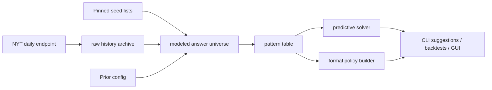

<div align="center">
  <h1>Maybe Wordle</h1>
  <p><strong>A Wordle solver for the NYT era where the answer list stopped behaving like a fixed museum exhibit.</strong></p>
  <p>
    
    
    
    
  </p>
</div>

> Classic Wordle solvers usually assume a fixed answer universe and a uniform prior.
> This project does not.
> It models modern NYT Wordle as a moving target: historical answers are fetched from the live daily endpoint, candidate answers are seeded from pinned community lists, and the app can switch between a fast heuristic predictive solver and a certificate-checked fixed-model policy builder.

## Why this repo exists

In February 2026, NYT started reusing past answers. That breaks a lot of old solver assumptions.

`maybe-wordle` is a Rust project built around three ideas:

- the answer set is modeled, not treated as divine truth
- the prior matters, because not all surviving answers are equally plausible
- "optimal" should mean optimal for a declared model, not "I guessed what the editor was thinking"

## Data and Network Use

`sync-data` is intended for personal research and reproducible solver experiments. Keep synced NYT responses, generated artifacts, and request volume modest, and do not redistribute data unless you have the right to do so.

## What it does

| Mode | What it optimizes | Best use |
| --- | --- | --- |
| `predictive` | Heuristic weighted search with bounded candidate pools and deeper endgame search | Fast everyday solving, not calibrated editorial probabilities |
| `formal-optimal` | Lexicographic worst-case depth and expected guesses over one pinned model | Reproducible fixed-model policy analysis |

Current commands:

```text
sync-data
build-model
build-optimal-policy
verify-optimal-policy
gui
add-manual
reconcile-seeds
merge-seeds
suggest
solve-interactive
explain-state
backtest
predictive-ablations
evaluate-live-config
three-guess-gap
four-guess-openers
build-predictive-opener
build-predictive-replies
experiments
evaluation-plan
parameter-registry
study-run
tune-prior
fit-proxy-weights
search-regret
benchmark
benchmark-evidence
benchmark-evidence-docs
rolling-compare
rolling-evidence-docs
```

## First run from scratch

If you cloned the repo and want a working baseline, run these in order:

```bash
cargo run -- sync-data
cargo run -- build-model
```

`sync-data` fetches the NYT daily JSON archive into `data/raw/nyt_daily_answers.jsonl`, one JSON row per puzzle date. On a fresh checkout this is usually the slowest step because it has to backfill history over the network.

Sync always retries missing dates, including old middle-of-archive gaps, and rechecks the configured recent window. HTTP `429` responses honor `Retry-After` with bounded retry delays. A partial sync never replaces a valid contiguous archive with a gapped one.

`build-model` turns that raw history into generated model CSVs under `data/derived/`. Model building, predictive artifact generation, and backtests reject non-contiguous history by default. `allow_history_gaps = true` in `config/prior.toml` is the explicit retrospective override. Generated history, CSV, pattern-table, predictive-book, and formal-policy files use durable sibling-temporary writes followed by atomic replacement.

Platform guarantees, filesystem assumptions, failure semantics, and injected interruption coverage are documented in [`docs/PERSISTENCE.md`](./docs/PERSISTENCE.md).

Optional but useful after that:

```bash
cargo run -- build-predictive-opener --date YYYY-MM-DD
cargo run -- build-predictive-replies --date YYYY-MM-DD
cargo run --release -- build-optimal-policy --model formal-v1
```

Predictive opener/reply artifacts live under `data/derived/predictive/`. Their versioned SHA-256 identity uses canonical length-delimited fields covering the ordered guesses, complete answer records, history snapshot, effective date weights, model variant, predictive policy, and config; same-count word substitutions or history mutations therefore invalidate stale books.

Formal artifacts live under `data/formal/<model>/`. They are the heaviest build in the repo and are only needed if you want exact-policy analysis.

Common first-run failures:

- missing seed files or an incomplete checkout under `data/seed/`
- no synced NYT history yet, so the requested date is outside the known range
- predictive artifacts missing or stale for the date you asked for, so the solver uses normal live ranking without artifact promotion unless you explicitly pass `--live-fallback`
- `formal-optimal` selected before `build-optimal-policy` has generated the complete matching `data/formal/<model>/` file set

## Quick start

```bash
cargo run -- sync-data
cargo run -- build-model
cargo run -- gui
cargo run -- suggest --guess crane --feedback 00000 --top 5 --date 2026-03-09
cargo run -- solve-interactive
```

`cargo run` with no arguments also opens the GUI.

## Release result

The selected predictive configuration is [`config/prior.toml`](./config/prior.toml), frozen as `selected-predictive-v20`.

| Evaluation | Games | Solved | All-game mean | 95% interval | Failures | Latency p95 |
| --- | ---: | ---: | ---: | ---: | ---: | ---: |
| 12-fold rolling development guard | 360 | 360 | **3.1778** | [3.1056, 3.2556] | 0 | 41.60 ms |
| Once-only sealed test | 30 | 30 | **3.3000** | [3.1333, 3.4667] | 0 | 38.50 ms |

Against the previous default, the selected configuration improved the development all-game mean by `-0.1222` guesses with paired block-bootstrap interval `[-0.1722, -0.0722]` and win/tie/loss counts `69/265/26`. It also repaired the previous default's two development failures. The sealed result had full coverage, a median of 3 guesses, p95 of 5, and a maximum of 5.

This evidence supports the selected solver, but it does **not** support a flat-three claim: the untouched sealed score was `3.3000`. That sealed window is now consumed and cannot be used for further tuning. Machine-readable records are [`rolling-selected-v20-final-20260726.json`](./benchmarks/predictive/rolling-selected-v20-final-20260726.json), [`frozen-candidate-v1.json`](./benchmarks/predictive/frozen-candidate-v1.json), and [`sealed-selected-v20-20260726.json`](./benchmarks/predictive/sealed-selected-v20-20260726.json).

<!-- BEGIN GENERATED PREDICTIVE EVIDENCE -->
## Predictive solver evidence

The former seven-profile table came from a pre-v15 artifact that lacks the cryptographic config fingerprint required by schema v4. It is retained as [`development-2026-06-17.json`](./benchmarks/predictive/development-2026-06-17.json) for audit history, but the current verifier intentionally rejects it and its figures are not release evidence.

Use the verified rolling guard and once-only sealed result above for current solve quality. A future seven-profile matrix must be regenerated under the current schema and a newly declared development window.

A current-schema probe was stopped under the release's 20-minute ceiling: profile 1 of 7 was still computing after more than four minutes and sustained roughly 13 busy CPU cores, implying more than 28 minutes even before the slower exact profiles. No partial artifact was published.
<!-- END GENERATED PREDICTIVE EVIDENCE -->

<!-- BEGIN GENERATED ROLLING EVIDENCE -->
### Rolling-origin promotion guard

Across 12 non-overlapping development folds (360 scheduled games), the sealed test was **not** evaluated. Coverage gaps and six-guess failures are hard constraints before mean score.

| Configuration | Solved | All-game mean | Delta vs default | W/T/L | Latency p95 | Guard decision |
| --- | ---: | ---: | ---: | ---: | ---: | --- |
| `current_default` | 358/360 | 3.3000 [3.2306, 3.3778] | reference | -- | 55.61 ms | retained |
| `selected-predictive-v20` | 360/360 | 3.1778 [3.1056, 3.2556] | -0.1222 [-0.1722, -0.0722] | 69/265/26 | 41.60 ms | eligible on solve quality |

| Configuration | Prior top-1/3/5 | Confidence ECE | Search steps P/L/XE/X | Recovery/fallback steps |
| --- | ---: | ---: | ---: | ---: |
| `previous-default` | 0.3%/0.6%/0.6% | 0.0022 [0.0008, 0.0081] | 383/137/0/666 | 32/157 |
| `selected-predictive-v20` | 0.3%/0.6%/0.6% | 0.0016 [0.0013, 0.0076] | 383/139/0/622 | 30/281 |

Development decisions:

- `selected-predictive-v20` is eligible on solve quality because the paired interval is entirely below zero.

This comparison did not access the sealed window; the release summary records its subsequent once-only evaluation.
<!-- END GENERATED ROLLING EVIDENCE -->

Example predictive query shape from the current local model data:

```text
> maybe-wordle suggest --guess crane --feedback 00000 --top 5 --mode predictive --date 2026-03-09
warning: predictive artifact unavailable for this state; disk-only mode will use live ranking without promotion
warning: reply-book artifact is missing for this date or branch; branch suggestions are coming from live evaluation
mode=predictive model=<policy> manifest=<hash> history_snapshot=<date> history_hash=<hash> artifact_status=<status> promoted_from_cache=<bool> date=2026-03-09 surviving=<count> total_weight=<weight>
<word> entropy=<bits> solve_prob=<probability> expected_remaining=<count>
```

## The shape of the system


```mermaid
flowchart LR
    A["NYT daily endpoint"] --> B["raw history archive"]
    C["Pinned seed lists"] --> D["modeled answer universe"]
    B --> D
    E["Prior config"] --> D
    D --> F["pattern table"]
    F --> G["predictive solver"]
    F --> H["formal policy builder"]
    G --> I["CLI suggestions / backtests / GUI"]
    H --> I
```

## Modeling stance

- `G`: all allowed guesses from a pinned snapshot of `tabatkins/wordle-list`
- `A_seed`: a curated candidate-answer seed list checked into the repo
- `H`: historical NYT answers fetched by date from the official daily endpoint
- primary `A_model`: `A_seed U date-bounded H U manual_additions`
- dormant fallback support: every syntactically valid guess, activated only by the declared recovery threshold/inconsistency rule

The prior is configurable in [`config/prior.toml`](./config/prior.toml). The default setup gives seed answers full base weight, history-only outliers reduced base weight, and applies a cooldown-plus-recovery curve to recently used answers.

This is the central bet of the repo: after answer reuse started, the right solver is not just "faster entropy on the old list". It needs a stated worldview.

## Data sources

Seed lists are pinned in-repo for reproducibility:

- valid guesses: `tabatkins/wordle-list`
- candidate answers: `joshstephenson/Wordle-Solver`
- reference answer list: `LaurentLessard/wordlesolver`

Source metadata lives in [`data/seed/sources.toml`](./data/seed/sources.toml).

The historical archive is fetched from the NYT daily puzzle endpoint:

- `https://www.nytimes.com/svc/wordle/v2/YYYY-MM-DD.json`

## Formal mode

`formal-optimal` is a fixed-model analysis mode, not a prediction of NYT editorial choices. It expects generated policy artifacts in `data/formal/<model>/`, including:

- `manifest.json`
- `state_values.bin`
- `policy_table.bin`
- `proof_metadata.json`
- `proof_certificate.json`
- `small_state_table.json`
- `pattern_table.bin`
- `prior.toml`

Build them with:

```bash
cargo run --release -- build-optimal-policy --model formal-v1
cargo run --release -- verify-optimal-policy --model formal-v1
```

The formal build is intentionally offline-heavy. Refinement pruning is disabled because its former dominance direction was not valid for the lexicographic objective. Certificate v7 records exact, non-progress, equivalent-partition, or admissible bound witnesses for every candidate and the states required to verify them. The independent verifier reconstructs feedback partitions, child states, probability masses, objective comparisons, and proof closure without calling the exhaustive optimizer or sharing the builder's partition implementation. A third slow reference and mutation tests cross-check tractable randomized universes.

The checked-in `data/formal/formal-v1/` directory may contain seed inputs such as `prior.toml` or `pattern_table.bin`, but it is not a usable formal policy until `build-optimal-policy` has generated the complete matching artifact set. Certificate format version 7 invalidates older formal outputs.

The machine-readable [`scale-v2.json`](./benchmarks/formal/scale-v2.json) benchmark used the full 14,855-word guess list with pinned answer prefixes through eight answers. The eight-answer certificate was about 1.05 GiB and process peak working set about 2.48 GiB; the next run was stopped because its projected peak exceeded the declared 4 GiB budget. Extrapolation to the complete 2,358-answer model is computationally infeasible, so formal claims are deliberately limited to independently verified tractable universes.

Formal artifacts are versioned. If the model inputs or serialized state format change, stale files are rejected and should be rebuilt.

If you only want fast suggestions, predictive mode works with the derived artifacts under [`data/derived`](./data/derived).

## Data layout

- [`data/raw`](./data/raw) stores the fetched NYT daily JSON archive as `nyt_daily_answers.jsonl`.
- [`data/derived`](./data/derived) stores generated modeled answers, the pattern table, and other shared derived outputs.
- [`data/derived/predictive`](./data/derived/predictive) stores generated predictive opener and reply caches.
- [`data/formal`](./data/formal) stores exact-policy artifacts by model id.

## Predictive experiments and books

Predictive mode now has a separate experiment and cache surface:

- `cargo run -- predictive-ablations --from YYYY-MM-DD --to YYYY-MM-DD`
- `cargo run -- evaluate-live-config --config path/to/prior.toml --from YYYY-MM-DD --to YYYY-MM-DD`
- `cargo run -- three-guess-gap --from YYYY-MM-DD --to YYYY-MM-DD`
- `cargo run -- four-guess-openers --from YYYY-MM-DD --to YYYY-MM-DD --opener crane`
- `cargo run -- build-predictive-opener --date YYYY-MM-DD`
- `cargo run -- build-predictive-replies --date YYYY-MM-DD`

The opener and reply caches are predictive-only artifacts under [`data/derived/predictive`](./data/derived/predictive). Filenames and serialized identity include the predictive manifest version and full model-manifest hash.

Opener artifacts are date-specific. The predictive suggestion API now exposes three modes:

1. `LiveOnly`: no artifact or session promotion
2. `FastDiskOnly`: disk artifacts only
3. `Full`: disk artifacts plus live session fallback

For `Full` root suggestions the solver uses this fallback chain:

1. exact-date opener artifact
2. newest earlier opener artifact within 14 days
3. live session opener computation

For `FastDiskOnly`, step 3 is skipped. Reply-book and third-turn artifacts use the same newest-earlier, configurable freshness rule (`session_artifact_freshness_days`, default 14) while still requiring the same model/context identity.

`build-predictive-opener` is heavier than ordinary suggestion commands: it evaluates a bounded opener pool on a recent 30-day window, tracks four-guess tails explicitly, and validates opener switches against a previous-window holdout. If you want fast predictive GUI/root suggestions for a specific date, build the opener artifact for that date ahead of time.

Predictive policy is now explicit and versioned. The config still loads from [`config/prior.toml`](./config/prior.toml), but the solver derives a named predictive policy from it and includes that policy id in predictive artifact identity.

Recovery behavior is also explicit. Every date-supported candidate remains in feedback filtering even when its modeled weight is zero. If feedback isolates only zero-mass candidates, predictive mode can fail loudly (`Strict`) or repair that branch with `UniformOverSupport` or `EpsilonRepair`. Future history-only words are not date-supported before their first appearance. The current default remains `EpsilonRepair`.

`evaluation-plan` emits the canonical expanding-window rolling-origin folds and sealed final-test window as JSON. `study-run` runs deterministic domain studies over development folds with typed parameters, grid/low-discrepancy/random/local-refinement/model-based sampling, atomic per-fold and per-suggestion checkpoints, cooperative cancellation, safe resume, hard-constraint violations, and Pareto ranks. `--base-config <TOML>` lets each stage start from a frozen finalist instead of the mutable default. Static strategies parallelize independent candidates and use serialized, nested time-spread successive-halving rungs so early pruning sees early, middle, and late development periods; finalists still evaluate all 12 folds. Fold scoring runs without latency measurement, then complete finalists receive serialized latency measurements after the parallel pool joins, preventing CPU contention from corrupting the promotion metric. Observation-driven TPE-style search is sequential so every suggestion consumes the preceding completed trial. Trial identity binds strategy, parallelism, fold selection, fold/time/peak-working-set budgets, canonical base config, registry, evaluation plan, data cutoff, launch-time source/data content, and the exact running executable. Long evidence and study commands recheck that identity at phase boundaries and fail instead of publishing a mixed-input run. Windows, Linux, and macOS studies sample the process working set at checkpoints, store the peak in trial measurements, fail a trial that crosses `--maximum-memory-mb`, and rank memory after latency. `tune-prior` uses the common prior-only calibration runner and applies an additional solve-quality guard before returning a complete TOML config. `fit-proxy-weights` is a compatibility shortcut for the common `proxy-ranker` stage; it changes only registered proxy-domain knobs and scores them on rolling all-game solve quality instead of the removed greedy 80/20 coordinate search. Evidence, rolling comparison, studies, tuning, and `evaluate-live-config` share the same canonical development/sealed boundary; ordinary development commands cannot evaluate the sealed window. `parameter-registry` emits all current predictive, book, recovery, operational, safety, and manual settings; only declared hyperparameters are optimizer-controlled.

Study format v16 and registry format v6 bind typed cohorts and canonical SHA-256 config/registry/data/code identities into provenance. Prefer the coherent stages `proxy-core`, `proxy-risk`, `proxy-small-state`, `search-routing`, `search-exact`, `search-coverage`, `search-lookahead`, `search-pool`, `search-danger`, and `search-penalty`; `proxy-ranker` and `solve-policy` remain aggregate compatibility stages. Registry tests compare all 85 entries against every serialized `PriorConfig` leaf, prove that every entry changes cryptographic config identity, and prove that all 79 optimizer-controlled knobs occur in exactly one granular stage. This includes formerly hidden opener-holdout, artifact-freshness, three-solve child limits, and danger posterior/candidate windows, mass/size disagreement cutoffs, and ambiguity saturation; `session_reply_pool` controls reply-book construction, and `second_guess_coverage_pool` is no longer clamped to 24. The ambiguity cutoff, normalized danger features, two candidate-pool expansion multipliers, six exact-pool source fractions, and separate reply bucket-ratio penalty are explicit study parameters. Static and model-based granular studies first generate one deterministic, config-valid perturbation for every eligible knob and reject a trial count too small to include that sweep plus the baseline; wider proposals begin only after this coverage prelude. Solver work runs on explicitly sized 8 MiB-stack threads, including the custom Rayon study pool, so deep exact branches do not inherit platform-default worker stacks. The default cumulative per-candidate wall-clock cap is two hours; pre-v16 study checkpoints are retained only as historical screening evidence because the audited feature algebra, parameterization, and latency protocol changed.

The exact predictive recurrence prunes with a weight-aware admissible lower bound rather than the former uniform-count bound. Skewed-prior and zero-mass-branch fixtures protect the correction, and probability concentration ignores zero-mass-only buckets while structural coverage diagnostics retain them. The 2026-07-19 audit also removed an extra unit that double-counted heuristic lookahead replies above the exact threshold and replaced the small-state proxy's uniform-count table with a weighted one-step cost. Those ranking changes require fresh rolling evidence; older generated scores remain audit history until regeneration completes. See [`docs/PREDICTIVE_MATH.md`](./docs/PREDICTIVE_MATH.md) for the formulas and scope.

`search-regret` provides a separate tractable-state check against exhaustive Bellman search. Its versioned reports follow deterministic artifact-free proxy paths, bind source/executable/data/config identity, and retain the exact observations for replay. The first audit exposed a proxy choice that could leave the entire state unchanged; all predictive regimes now exclude non-progressing guesses. After that fix, bounded lookahead matched exhaustive cost on 27/30 sampled states across the 3–16 survivor bands, with combined mean regret about `0.000072`; proxy-only ranking had combined mean regret about `0.159111` and reached `0.899180` on one state. This supports keeping bounded lookahead, but it is a math diagnostic—not a sealed-test or mean-guesses claim. See [`search-regret-v1.json`](./benchmarks/predictive/search-regret-v1.json) and [`search-regret-9-16-v1.json`](./benchmarks/predictive/search-regret-9-16-v1.json).

The release performance profile covers the full 2,358-answer proxy root plus replayable 15-answer lookahead and pooled-exact states. Warm suggestion latency was `36.724 ms`, `94.153 ms`, and `189.173 ms` respectively on the recorded Windows/AMD system; process peak working set reached `83.0 MiB`. The dedicated allocator benchmark also records CPU time, process cycles, allocation calls/bytes, page faults, cold/warm ratios, executable/config/input identity, and explicit measurement limitations. See [`docs/PERFORMANCE.md`](./docs/PERFORMANCE.md) and [`release-performance-v1.json`](./benchmarks/predictive/release-performance-v1.json).

`book-policy` performs cutoff-safe optimization: each candidate/fold gets an isolated artifact namespace, opener/reply artifacts are rebuilt from history available at the training cutoff and each 14-day freshness boundary, and validation runs in disk-only mode. Cancellation, time, and memory budgets are checked between snapshots. `joint` remains artifact-free because its registered space excludes book parameters; book finalists enter only an explicit final refinement cohort.

Special diagnostic configurations are data, not hidden code branches. [`config/profiles/aggressive-three-guess.json`](./config/profiles/aggressive-three-guess.json), [`config/profiles/offline-book.json`](./config/profiles/offline-book.json), and [`config/profiles/wide-pools.json`](./config/profiles/wide-pools.json) are versioned parameter overlays parsed and validated by the same registry used for studies. The migration exposed invalid legacy pool ordering; serialized profiles now keep root candidate/reply pools within declared bounds and no larger than their medium-state counterparts. The old flattened ablations were removed because they silently rewrote `manual_weights`; manual word overrides remain a separate auditable layer.

Fixed benchmark and ablation cohorts are also declarative. [`config/experiments/development-evidence.json`](./config/experiments/development-evidence.json) defines seven generated-README baselines, including an immutable previous-release config, and can bind a safe repository-relative base config before typed overlays. [`config/experiments/predictive-ablations.json`](./config/experiments/predictive-ablations.json) defines the baseline/wide-pool combinations, including weight mode, model variant, artifact policy, and typed parameter overlays. Exact-zero float values are accepted only through the diagnostic-profile path so entropy ablations can disable terms without changing the strictly positive log-search domains.

Non-optimizer search diagnostics are declarative too. [`config/experiments/diagnostic-suite.json`](./config/experiments/diagnostic-suite.json) owns the three-guess rescue profile and root/reply limits, default four-guess opener tournament, hard-case category count and scan/cutoff values, book forced-search depth, and evidence/evaluation/study latency sample budgets. The shipped suite is schema-validated and tested. These settings no longer survive as disconnected constants in solver code; all promotable parameter search remains in the typed Rust study runner.

The current equal-compute prior-calibration diagnostic gives every strategy eight candidates × twelve folds (96 candidate-fold evaluations). Lower is better:

| Strategy | Best log loss | Best Brier | Coverage gaps | Interpretation |
| --- | ---: | ---: | ---: | --- |
| grid | 7.169984 | 0.999187423 | 23/360 | tiny improvement |
| low discrepancy | 7.170026 | 0.999187426 | 23/360 | tiny improvement |
| random | 7.166967 | 0.999144443 | 23/360 | best static strategy at this seed |
| local refinement | 7.168935 | 0.999173901 | 23/360 | useful after global exploration |
| model-based portfolio | **7.063526** | **0.998947748** | 23/360 | best shared-seed result; sequential |

Across five model-based seeds, best log loss had median 7.063526 and range 6.695866–7.121388. The TPE suggestion itself won three seeds; on the other two, its deterministic global startup pool won. The selected route is therefore multi-seed global startup plus observation-driven refinement, followed by hard-constraint-safe rolling solve evaluation and local refinement—not promotion from calibration alone. These runs did not measure guesses, change the selected solver config, or open the sealed test. The machine-readable record is [`benchmarks/predictive/study-strategy-comparison-v8.json`](./benchmarks/predictive/study-strategy-comparison-v8.json); the earlier format-v5 diagnostic is retained only as an audit trail.

The strongest calibration-only candidate was rejected for failures, and a follow-on `CoverageRecovery` study found a zero-failure threshold-4 candidate. Later feature-algebra and parameterization audits superseded that screening result. The final v20 configuration passed the replacement 12-fold rolling guard at `360/360` and `3.1778`, then scored `30/30` and `3.3000` on the once-only sealed test. The older [`rolling-prior-recovery-threshold4-lookahead-audit-20260719-v2.json`](./benchmarks/predictive/rolling-prior-recovery-threshold4-lookahead-audit-20260719-v2.json) remains an audit record, not current promotion evidence.

The previous Python/Optuna path is not an evidence source for promotion. [`benchmarks/predictive/legacy-optuna-archive.json`](./benchmarks/predictive/legacy-optuna-archive.json) deterministically preserves 33 completed historical trials from three local SQLite databases, including source SHA-256, parameters, and reported metrics; six unfinished trials are counted and ignored. Those runs lack current provenance, guarded objectives, and resource budgets. Rebuild or verify the archive with `python scripts/import_optuna_archive.py [--check]`, and re-evaluate any interesting configuration through `study-run`/`rolling-compare`.

`rolling-compare` evaluates a named candidate over every development fold and can safely reuse a prior default baseline only when the complete plan and canonical default TOML match. `benchmark-evidence-docs` and `rolling-evidence-docs` update or verify the generated README sections from their JSON artifacts.

`benchmark-evidence` writes versioned JSON plus a generated Markdown fragment and rejects any requested range that reaches the sealed test. Long runs emit flushed `profile-start`, per-game, and `profile-complete` records with completed/total work, elapsed time, and an evolving ETA. Games within one profile already use the full Rayon pool; profiles remain sequential so they do not oversubscribe the same cores or contaminate latency measurements. The selected v20 configuration is frozen and shipped as the default. Its sealed score is `3.3000`, so this is explicitly not a three-guess claim.

Backtests keep coverage gaps in all-game denominators and report both an explicitly conditional mean over modeled games and a failure-penalized all-game mean. Mean intervals and paired comparisons use deterministic chronological block bootstrap samples; coverage and solve rates use Wilson intervals. Experiment output also includes log loss and multiclass Brier score. These are diagnostics for a heuristic prior, not evidence that its probabilities are calibrated.

The equations, domains, exact-versus-heuristic boundaries, coupling audit, and verification map are documented in [`docs/PREDICTIVE_MATH.md`](./docs/PREDICTIVE_MATH.md).

The Rust GUI is a predictive-first analyst workspace with dedicated Play, Policy, Diagnostics, and secondary Formal panels. Heavy recomputes use two isolated workers sharing one replaceable pending slot: stale queued work is discarded, a newer generation can run while one obsolete request finishes, and stale responses cannot replace current state. Play includes keyboard feedback codes (`0/1/2` or `b/y/g`), Enter-to-apply, an accessible six-row board, compact history, sortable evidence, a suggestion inspector, and a filterable/exportable candidate list. Text scaling and a stacked layout keep the workflow usable in narrow windows. Diagnostics distinguishes exhaustive exact, candidate-pool exact, and proxy/lookahead allocation.

Missing derived data no longer prevents the window from opening. The setup surface offers explicit public-history sync, local build, retry, progress/error reporting, and cooperative cancellation at phase/request boundaries. Formal artifacts remain optional; their absence does not block predictive play.

The native usability pass covered initial suggestions, symbolic feedback normalization, Enter-to-apply, alternative inspection, undo, wide and 713-pixel compact layouts, full-workspace scrolling, diagnostics/provenance layout, and an isolated missing-data recovery fixture. The fixture also verified that a failed local rebuild remains recoverable and reports an actionable error instead of closing the app.

CLI and GUI predictive mode are intentionally conservative:

- the GUI uses the unified predictive suggestion API in `FastDiskOnly` mode by default
- the CLI predictive path uses `FastDiskOnly` by default
- pass `--live-fallback` to CLI `suggest` or `solve-interactive` to opt into `Full`
- `FastDiskOnly` means "use disk artifacts, do not promote a live session fallback"
- `Full` means "use disk artifacts first, then allow live-session fallback if the artifact chain is missing"
- `recovery mode` means the solver had to repair a zero-mass state before it could keep ranking guesses
- if predictive artifacts are missing, the GUI should make that explicit instead of implying a richer artifact-backed result exists

## Quality bar

- duplicate-letter scoring is tested explicitly
- the formal builder and empty-cache verifier are compared on toy universes, including randomized states in 13–40-answer universes, while remaining shared-code limitations are documented above
- seed-list maintenance has regression coverage
- predictive promotion and recovery-mode behavior has characterization coverage
- `cargo test` is the expected full verification gate after code changes

## Running the preserved Windows executable

The locally packaged release build is `dist/maybe-wordle.exe` (ignored by Git). Run it directly for the GUI or pass any CLI command, for example `dist/maybe-wordle.exe solve-interactive`. The executable expects to be run from this repository so it can find `config/` and `data/`. Rebuild it with `cargo build --release`, copy `target/release/maybe-wordle.exe` to `dist/`, then remove `target/` if you want a clean source tree.

## Repo map

<details>
<summary>Open the project layout</summary>

```text
config/
  prior.toml
data/
  raw/        # NYT history archive
  seed/       # pinned guess and answer seeds
  derived/    # modeled answers, pattern tables, and shared derived outputs
    predictive/  # predictive opener and reply caches
  formal/     # exact-policy artifacts by model id
src/
  atomic_file.rs
  predictive/
    books.rs
    policy.rs
    recovery.rs
    search.rs
    state.rs
    types.rs
  solver/
    artifact_identity.rs
    books.rs
  config.rs
  data.rs
  formal.rs
  gui.rs
  main.rs
  model.rs
  pattern_table.rs
  scoring.rs
  seed.rs
  small_state.rs
  solver.rs
tests/
  integration.rs
  predictive_characterization.rs
PLAN.md
```

</details>

## If you want to poke at it

```bash
cargo test
cargo run -- backtest
cargo run -- experiments
cargo run -- gui
```

If you want the longer design rationale, the planning notes are in [`PLAN.md`](./PLAN.md).
