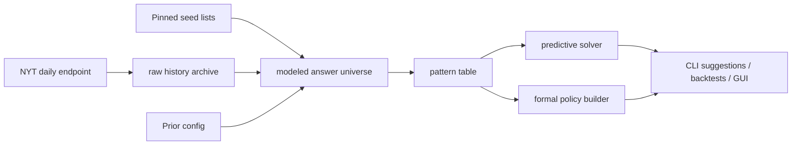

<div align="center">
  <h1>Maybe Wordle</h1>
  <p><strong>A Wordle solver for the NYT era where the answer list stopped behaving like a fixed museum exhibit.</strong></p>
  <p>
    
    
    
    
  </p>
</div>

> Classic Wordle solvers usually assume a fixed answer universe and a uniform prior.
> This project does not.
> It models modern NYT Wordle as a moving target: historical answers are fetched from the live daily endpoint, candidate answers are seeded from pinned community lists, and the app can switch between a fast heuristic predictive solver and a certificate-checked fixed-model policy builder.

## Next-release work in progress

Production remains v20; no newer configuration has passed every release guard. The declared evaluation policy in [`config/evaluation.toml`](./config/evaluation.toml) freezes development through 2026-08-26 and reserves 2026-08-28 through 2026-09-26 as an untouched seal. The consumed June 18–July 17 seal is excluded from new validation targets.

The latest bounded policy investigation fixes the known nine- and 22-survivor
hard-mode choices; all six audited states now match the exhaustive reference to
floating-point precision. It has not established a lower overall average score.
See the [screen results and limitations](./docs/SEPTEMBER_RELEASE.md#bounded-oldnew-policy-investigation).
Two earlier validated 30-game development runs (first (`benchmarks/predictive/september-policy-30day-validated-v1.json`),
repeat (`benchmarks/predictive/september-policy-30day-validated-repeat-v1.json`)) solved
30/30 with finite versus 28/30 with staged, but finite scored 3.6000 and
3.6667 against staged's repeatable 3.4000 (failures penalized as seven).
The same executable/config/data identities produced eight different finite
paths; every divergent choice hit the 250 ms deadline. The [generated tables](./docs/generated/september-policy-30day-validated.md)
and [repeat table](./docs/generated/september-policy-30day-validated-repeat.md)
record the paired results. Earlier-source runs are retained; none
establishes a lower mean or justifies promotion.

An experiment-only fixed-work comparison (`benchmarks/predictive/september-policy-fixed-work-v1.json`)
and repeat (`benchmarks/predictive/september-policy-fixed-work-repeat-v1.json`)
gave identical 30-game finite paths and per-move traces with no deadline exits.
Both scored 3.5000 with 30/30 solves, against 3.6333 and 3.6667 for 250 ms
finite Fast. The paired improvement intervals include zero, and staged's earlier
3.4000 remains lower. This control improves repeatability, not release status.
The preceding-binary staged-versus-fixed comparison (`benchmarks/predictive/september-staged-fixed-work-v1.json`)
and repeat (`benchmarks/predictive/september-staged-fixed-work-repeat-v1.json`)
confirmed those scores on the same 30 dates: staged 3.4000 with 28 solves,
fixed work 3.5000 with 30. Fixed work was slower and had worse initial-state
probability scores; its paired guess-score interval includes zero. The two modes
also use different effective support/recovery semantics despite sharing one
configuration file, so this is an end-to-end policy comparison, not an isolated
search-algorithm win.

A September 26, equal-initial-belief 12-fold finite baseline versus Fast
comparison (`benchmarks/predictive/september-finite-matched-budget-current-v1.json`)
and fresh repeat (`benchmarks/predictive/september-finite-matched-budget-current-repeat-v1.json`)
covered 360 development games each at the same 250 ms budget. The baseline
repeated at 3.5389 with 354/360 solves; Fast solved 360/360 but scored 3.5694
and 3.5528 (penalty seven). Its paired mean differences were +0.0306 and
+0.0139 guesses, with both intervals spanning zero. Fast changed 20 game
paths and eight game scores between runs, while baseline paths repeated.
This isolates the finite rollout choice more cleanly than the staged comparison,
but shows no mean-score win or deterministic deadline behavior. It does not
justify changing production.

An earlier-build selected-policy 12-fold development comparison (`benchmarks/predictive/september-staged-finite-current-source-v1.json`)
and fresh Fast repeat (`benchmarks/predictive/september-staged-finite-current-source-repeat-v1.json`)
put staged at **3.2000 all-game guesses** with 358/360 solves and no coverage
gaps. Finite Fast solved 360/360 but scored 3.5556 and 3.5639, with paired
Fast-minus-staged intervals entirely above zero. Staged paths repeated; Fast
changed 13 paths and eight game scores. This is development evidence from the
preceding executable identity,
not a sealed or prospective score, and the policies start from different
effective beliefs. It supports keeping staged as the selected policy, not a
flat-three claim or a finite promotion.

A one-coefficient staged-policy 30-game screen (`benchmarks/predictive/september-v19b-staged-screen-v1.json`)
and full 12-fold follow-up (`benchmarks/predictive/september-v19b-staged-final-build-v1.json`)
tested the older v19b entropy weight. A preceding rebuild
reproduced all 360 baseline and candidate game paths and scores. It recovered one of
staged's two development failures and scored 3.1944 versus 3.2000 across
360 games, but the paired interval [-0.0278, +0.0139] includes no change and
one failure remains. This is a useful negative/inconclusive screen, not a
selected config change or a three-guess result.

An earlier-binary 12-fold terminal-rule replay (`benchmarks/predictive/september-v19b-staged-terminal-legal-current-binary-v1.json`)
uses a direct failure-first decision with two turns remaining, counting only
answers that can legally be guessed on the final turn. Selected staged
now solves **360/360 at 3.1944** all-game guesses; v19b solves 360/360 at
3.1917. Selected staged solved 275/360 by turn three (31 in two, 244 in
three); its p95 was four guesses and maximum was six. Reaching an exact
3.0000 on these same games would require 70 fewer total guesses. Only two
selected paths changed from the preceding build, both
previously unsolved. The candidate-minus-selected paired difference is
-0.0028 guesses, 95% interval [-0.0222, +0.0167], so v19b is still not
promoted. This is allowed development evidence, not a sealed or prospective
result and not a flat-three claim. Its 720 development-game paths exactly
reproduced the preceding-build replay (`benchmarks/predictive/september-v19b-staged-terminal-legal-v1.json`);
the current run took 16.2 minutes and did not evaluate the reserved seal.

A follow-up 12-fold replay (`benchmarks/predictive/september-staged-root-bound-rolling-v1.json`)
of the same selected and v19b policies reproduced all 720 game paths and
scores after an admissible pooled-exact pruning change. The final build took 8.2 minutes
on this machine; a matched first-feedback top-ten CLI request fell from
55.15 to 3.92 seconds with identical suggestions and exact costs. This is a
performance improvement, not a lower mean-guess score or proof of the
still-open six-turn objective. See the [measurement details](docs/PERFORMANCE.md).

The completed pre-validator-build [12-fold replay table](./docs/generated/september-post-layout-tests-rolling-v1.md)
used CLI SHA-256 `ECFEE91B8199956E327954BD5E5BE233F07129A8C2CDE3D6F4612CA740B46B72`
over the 12 allowed development folds and recorded `sealed_test_evaluated=false`.
Selected staged and v19b each solved 360/360 with zero coverage gaps/failures at
3.194444 and 3.191667 all-game guesses; per-move p95 was 20.7277 and 20.7633 ms.
V19b-minus-selected was -0.0027778 guesses, 95% CI [-0.0222222, +0.0166667],
with 6/347/7 wins/ties/losses. The run took 508.3 seconds and peaked at
168898560 bytes (about 161.1 MiB). All 720 outcomes and paths exactly matched the
[previous replay table](./docs/generated/september-post-dynamic-mode-rolling-v1.md).
The word-bearing per-game artifact remains local; a [redacted public copy](./docs/evidence/september-post-layout-tests-rolling-public-v1.json)
preserves the reported outcomes and calibration numbers without answer or guess words.
This is retrospective development evidence; no promotion or flat-three claim follows.

An earlier-binary matched-belief 30-game comparison (`benchmarks/predictive/september-matched-belief-fixed-work-v1.json`)
and exact repeat (`benchmarks/predictive/september-matched-belief-fixed-work-repeat-v1.json`)
isolated search on the same frozen posterior: staged ranked at 3.2000 versus
finite fixed-work at 3.5000, with 30/30 solves and no coverage gaps for both.
A matched-belief Strong follow-up (`benchmarks/predictive/september-matched-belief-strong-v1.json`)
also lost: 3.5667 versus staged's 3.2000 on the same 30 dates, despite 30/30
solves, and used roughly six times the per-move p95 latency. Increasing the
finite search budget alone does not close the quality gap.
A separate belief ablation (`benchmarks/predictive/september-staged-belief-ablation-v1.json`)
found a lower frozen-belief point mean than dynamic staged, but the paired
interval crossed zero and calibration and latency worsened. Neither diagnostic
changes the selected policy or establishes a prospective improvement.
A later opt-in dynamic-belief finite trial also failed its 30-game screen:
3.4333 versus selected staged's 3.3333, with 30/30 solves but about 12 times
the per-step p95 latency. The selected route was restored and reproduced all
30 earlier paths; the detailed [negative result and provenance limits](docs/SEPTEMBER_RELEASE.md#dynamic-belief-six-turn-experiment-and-rejection)
are recorded separately from release evidence.

A reproducible opt-in [dynamic-belief finite comparison](./config/experiments/september-dynamic-finite-matched.json)
now supersedes that trial for auditability. Its five-day screen (`benchmarks/predictive/september-dynamic-finite-screen-v1.json`)
([generated table](./docs/generated/september-dynamic-finite-screen-v1.md))
had staged and `finite_fast_dynamic` at 3.0000 and 3.2000 with 5/5 solves;
latency p95 was 21.17 and 257.33 ms. The 30-day artifact (`benchmarks/predictive/september-dynamic-finite-30day-v1.json`)
([generated table](./docs/generated/september-dynamic-finite-30day-v1.md))
covered July 28-August 26: both solved 30/30 with zero gaps/failures, while
staged scored 3.3333 versus 3.4000 for dynamic finite. The paired
dynamic-minus-staged result was +0.0667 guesses, 95% CI [-0.1333, +0.2667],
with 4/21/5 wins/ties/losses; latency p95 was 21.24 versus 256.62 ms and
initial log loss/Brier were identical at 6.5971/0.9986. Generation took 52.10 s
and peaked at 133.3 MiB. Dynamic roots chose `olate` on all 30 games, averaging
0.004110 modeled root risk and 3.3002 expected attempts; every root hit its
deadline, and both profiles recorded five recovery steps. This retrospective
development run has `sealed_test_evaluated=false`, passes neither score nor
latency guard, and does not promote the policy. The fixed-belief-only finite
`search-regret` diagnostic is not validation of dynamic mode; production remains
unchanged.

The [September acceptance plan](docs/SEPTEMBER_RELEASE.md) puts shared game semantics
and bounded search before further tuning. Live requests now name the puzzle date and
derive history through the preceding day; effective model identities exclude future
history. Current source has correctness changes and is not validated by the old v20
scores. The retained `dist/` executables match the latest uncommitted source
build and remain runnable; that does not make the experimental finite policy
a release candidate.
The GUI starts without a console window. A native accessibility-tree check
found the Play controls and separate board/suggestions panels, while a locked
desktop prevented a visual/keyboard pass; that gate remains open. The finite
policy has not passed the score or release
gates.

Private benchmark diagnostics are local-only and are not included in a clean checkout.

Study v18 repairs grid endpoints, unique dimensions and complete elite inheritance;
registry v7 removes the obsolete coverage child cap. It retains v17's solved-histogram
totals and exclusion of shared-process memory from ranking. Older studies are historical
evidence and cannot be resumed against the changed policy. New pattern caches use
`MWORDPT3` with a SHA-256 payload digest and regenerate older caches automatically.
Fresh evaluation and release verification remain in [`TODO.md`](./TODO.md).

## Why this repo exists

In February 2026, NYT started reusing past answers. That breaks a lot of old solver assumptions.

`maybe-wordle` is a Rust project built around three ideas:

- the answer set is modeled, not treated as divine truth
- the prior matters, because not all surviving answers are equally plausible
- "optimal" should mean optimal for a declared model, not "I guessed what the editor was thinking"

## Data and Network Use

`sync-data` is intended for personal research and reproducible solver experiments. Keep synced NYT responses, generated artifacts, and request volume modest, and do not redistribute data unless you have the right to do so.

## What it does

| Mode | What it optimizes | Best use |
| --- | --- | --- |
| `predictive` | Heuristic weighted search with bounded candidate pools and deeper endgame search | Fast everyday solving, not calibrated editorial probabilities |
| `formal-optimal` | Lexicographic worst-case depth and expected guesses over one pinned model | Reproducible fixed-model policy analysis |

Current commands:

```text
sync-data
build-model
build-optimal-policy
verify-optimal-policy
gui
add-manual
reconcile-seeds
merge-seeds
suggest
solve-interactive
explain-state
backtest
predictive-ablations
evaluate-live-config
three-guess-gap
four-guess-openers
build-predictive-opener
build-predictive-replies
experiments
evaluation-plan
parameter-registry
study-run
tune-prior
fit-proxy-weights
learned-proxy-experiment
survival-experiment
search-regret
benchmark
benchmark-evidence
benchmark-evidence-docs
rolling-compare
rolling-evidence-docs
```

## First run from scratch

If you cloned the repo and want a working baseline, run these in order:

```bash
cargo run -- sync-data
cargo run -- build-model
```

`sync-data` fetches the NYT daily JSON archive into `data/raw/nyt_daily_answers.jsonl`, one JSON row per puzzle date. On a fresh checkout this is usually the slowest step because it has to backfill history over the network.

Sync always retries missing dates, including old middle-of-archive gaps, and rechecks the configured recent window. HTTP `429` responses honor `Retry-After` with bounded retry delays. A partial sync never replaces a valid contiguous archive with a gapped one.

`build-model` turns that raw history into generated model CSVs under `data/derived/`. Model building, predictive artifact generation, and backtests reject non-contiguous history by default. `allow_history_gaps = true` in `config/prior.toml` is the explicit retrospective override. Generated history, CSV, pattern-table, predictive-book, and formal-policy files use durable sibling-temporary writes followed by atomic replacement.

Platform guarantees, filesystem assumptions, failure semantics, and injected interruption coverage are documented in [`docs/PERSISTENCE.md`](./docs/PERSISTENCE.md).

Optional but useful after that:

```bash
cargo run -- build-predictive-opener --date YYYY-MM-DD
cargo run -- build-predictive-replies --date YYYY-MM-DD
cargo run --release -- build-optimal-policy --model formal-v1
```

Predictive opener/reply artifacts live under `data/derived/predictive/`. Their versioned SHA-256 identity uses canonical length-delimited fields covering the ordered guesses, complete answer records, history snapshot, effective date weights, model variant, predictive policy, and config; same-count word substitutions or history mutations therefore invalidate stale books.

Formal artifacts live under `data/formal/<model>/`. They are the heaviest build in the repo and are only needed if you want exact-policy analysis.

Common first-run failures:

- missing seed files or an incomplete checkout under `data/seed/`
- no synced NYT history yet, so the requested date is outside the known range
- predictive artifacts missing or stale for the date you asked for, so the solver uses normal live ranking without artifact promotion unless you explicitly pass `--live-fallback`
- `formal-optimal` selected before `build-optimal-policy` has generated the complete matching `data/formal/<model>/` file set

## Quick start

```bash
cargo run -- sync-data
cargo run -- build-model
cargo run -- gui
cargo run -- suggest --guess crane --feedback 00000 --top 5 --date 2026-03-09
cargo run -- solve-interactive
```

`cargo run` with no arguments also opens the GUI.

## Selected policy and evidence

The selected predictive configuration is [`config/prior.toml`](./config/prior.toml), frozen as `selected-predictive-v20`.
The table below is its historical promotion result from an earlier executable;
the September 26 development replay follows in the generated section.

| Evaluation | Games | Solved | All-game mean | 95% interval | Failures | Latency p95 |
| --- | ---: | ---: | ---: | ---: | ---: | ---: |
| 12-fold rolling development guard | 360 | 360 | **3.1778** | [3.1056, 3.2556] | 0 | 41.60 ms |
| Once-only sealed test | 30 | 30 | **3.3000** | [3.1333, 3.4667] | 0 | 38.50 ms |

Against the previous default, the selected configuration improved the development all-game mean by `-0.1222` guesses with paired block-bootstrap interval `[-0.1722, -0.0722]` and win/tie/loss counts `69/265/26`. It also repaired the previous default's two development failures. The sealed result had full coverage, a median of 3 guesses, p95 of 5, and a maximum of 5.

This historical evidence does **not** support a flat-three claim: the untouched sealed score was `3.3000`. That sealed window is now consumed and cannot be used for further tuning. Machine-readable records are [`rolling-selected-v20-final-20260726.json`](./benchmarks/predictive/rolling-selected-v20-final-20260726.json), [`frozen-candidate-v1.json`](./benchmarks/predictive/frozen-candidate-v1.json), and [`sealed-selected-v20-20260726.json`](./benchmarks/predictive/sealed-selected-v20-20260726.json).

The following September 26 pre-validator-build development diagnostic compares the selected
staged policy with exploratory v19b on 12 permitted folds. It does not reuse
the consumed June 18-July 17 validation window or open the reserved August
28-September 26 seal. It is neither a prospective result nor the pending
seven-profile release matrix. The earlier five-prior screen remains in the
[release ledger](./docs/SEPTEMBER_RELEASE.md).

<!-- BEGIN GENERATED PREDICTIVE EVIDENCE -->
## Predictive solver evidence

Development-only diagnostic for `2025-07-03` through `2026-08-26` using selection `rolling_folds` (2025-07-03..2025-08-01, 2025-08-02..2025-08-31, 2025-09-01..2025-09-30, 2025-10-01..2025-10-30, 2025-10-31..2025-11-29, 2025-11-30..2025-12-29, 2025-12-30..2026-01-28, 2026-01-29..2026-02-27, 2026-02-28..2026-03-29, 2026-03-30..2026-04-28, 2026-04-29..2026-05-28, 2026-07-28..2026-08-26) and history through `2026-08-26`. The sealed test was **not** evaluated.

Measured generation compute time: 508.32 s; process peak working set: 161.1 MiB; enforced budget: 1200 s / 4096 MiB.

| Baseline | Coverage | Solved | All-game mean (7-guess penalty) | Conditional mean | 3 guesses | 4 guesses | Paired delta vs reference | W/T/L | Log loss | Brier | Latency p95 | Session fallback cold/warm |
| --- | ---: | ---: | ---: | ---: | ---: | ---: | ---: | ---: | ---: | ---: | ---: | ---: |
| `selected_staged` | 100.0% (360/360) | 100.0% (360/360) | 3.1944 [3.1194, 3.2722] | 3.1944 [3.1194, 3.2722] | 76.4% | 96.7% | +0.0000 [+0.0000, +0.0000] | 0/360/0 | 6.6703 | 0.9987 | 20.73 ms | n/a/n/a |
| `v19b_staged` | 100.0% (360/360) | 100.0% (360/360) | 3.1917 [3.1194, 3.2694] | 3.1917 [3.1194, 3.2694] | 76.1% | 96.9% | -0.0028 [-0.0222, +0.0167] | 6/347/7 | 6.6703 | 0.9987 | 20.76 ms | n/a/n/a |

Session-fallback timings are milliseconds; n/a means live session books are not used by that profile and were not benchmarked.

Measured artifact sizes: `pattern_table` = 35132187 bytes; `answer_history` = 64472 bytes; `modeled_answers` = 177428 bytes; `predictive_books` = 812321 bytes.

| Baseline | Prior top-1 | Prior top-3 | Prior top-5 | Confidence ECE | Search steps P/L/XE/X/F | Recovery/fallback steps | Artifact/session hits |
| --- | ---: | ---: | ---: | ---: | ---: | ---: | ---: |
| `selected_staged` | 0.3% | 0.6% | 0.6% | 0.0017 [0.0013, 0.0077] | 386/139/0/625/0 | 36/292 | 0/0 |
| `v19b_staged` | 0.3% | 0.6% | 0.6% | 0.0017 [0.0013, 0.0077] | 386/131/0/632/0 | 36/297 | 0/0 |

Post-feedback posterior proper scores (means are conditional on scored states; scored/total keeps unscored gaps visible):

| Baseline | Stratum | Turn | Scored/total states | Target probability | Log loss | Brier |
| --- | --- | ---: | ---: | ---: | ---: | ---: |
| `selected_staged` | all | 1 | 332/360 | 0.0013 | 6.6703 | 0.9987 |
| `selected_staged` | all | 2 | 334/360 | 0.1201 | 2.8215 | 0.8792 |
| `selected_staged` | all | 3 | 320/329 | 0.7421 | 0.5525 | 0.2577 |
| `selected_staged` | all | 4 | 84/85 | 0.8448 | 0.3250 | 0.1448 |
| `selected_staged` | all | 5 | 12/12 | 0.6448 | 0.5897 | 0.3808 |
| `selected_staged` | all | 6 | 4/4 | 1.0000 | -0.0000 | 0.0000 |
| `selected_staged` | never_used | 1 | 315/343 | 0.0013 | 6.6155 | 0.9986 |
| `selected_staged` | never_used | 2 | 317/343 | 0.1219 | 2.7757 | 0.8748 |
| `selected_staged` | never_used | 3 | 303/312 | 0.7527 | 0.5150 | 0.2428 |
| `selected_staged` | never_used | 4 | 76/77 | 0.8403 | 0.3450 | 0.1540 |
| `selected_staged` | never_used | 5 | 12/12 | 0.6448 | 0.5897 | 0.3808 |
| `selected_staged` | never_used | 6 | 4/4 | 1.0000 | -0.0000 | 0.0000 |
| `selected_staged` | reused | 1 | 17/17 | 0.0008 | 7.6872 | 0.9998 |
| `selected_staged` | reused | 2 | 17/17 | 0.0855 | 3.6756 | 0.9605 |
| `selected_staged` | reused | 3 | 17/17 | 0.5519 | 1.2222 | 0.5237 |
| `selected_staged` | reused | 4 | 8/8 | 0.8881 | 0.1358 | 0.0569 |
| `selected_staged` | out_of_core | 1 | 0/28 | n/a | n/a | n/a |
| `selected_staged` | out_of_core | 2 | 2/28 | 0.0170 | 4.6022 | 1.3337 |
| `selected_staged` | out_of_core | 3 | 19/28 | 0.2065 | 3.1306 | 1.0928 |
| `selected_staged` | out_of_core | 4 | 23/24 | 0.5470 | 1.0525 | 0.4781 |
| `selected_staged` | out_of_core | 5 | 12/12 | 0.6448 | 0.5897 | 0.3808 |
| `selected_staged` | out_of_core | 6 | 4/4 | 1.0000 | -0.0000 | 0.0000 |
| `v19b_staged` | all | 1 | 332/360 | 0.0013 | 6.6703 | 0.9987 |
| `v19b_staged` | all | 2 | 334/360 | 0.1195 | 2.7936 | 0.8798 |
| `v19b_staged` | all | 3 | 320/329 | 0.7348 | 0.5578 | 0.2643 |
| `v19b_staged` | all | 4 | 85/86 | 0.8612 | 0.2915 | 0.1276 |
| `v19b_staged` | all | 5 | 11/11 | 0.6832 | 0.5067 | 0.3280 |
| `v19b_staged` | all | 6 | 3/3 | 1.0000 | -0.0000 | 0.0000 |
| `v19b_staged` | never_used | 1 | 315/343 | 0.0013 | 6.6155 | 0.9986 |
| `v19b_staged` | never_used | 2 | 317/343 | 0.1210 | 2.7527 | 0.8756 |
| `v19b_staged` | never_used | 3 | 303/312 | 0.7447 | 0.5220 | 0.2501 |
| `v19b_staged` | never_used | 4 | 77/78 | 0.8585 | 0.3077 | 0.1349 |
| `v19b_staged` | never_used | 5 | 11/11 | 0.6832 | 0.5067 | 0.3280 |
| `v19b_staged` | never_used | 6 | 3/3 | 1.0000 | -0.0000 | 0.0000 |
| `v19b_staged` | reused | 1 | 17/17 | 0.0008 | 7.6872 | 0.9998 |
| `v19b_staged` | reused | 2 | 17/17 | 0.0906 | 3.5568 | 0.9588 |
| `v19b_staged` | reused | 3 | 17/17 | 0.5589 | 1.1963 | 0.5171 |
| `v19b_staged` | reused | 4 | 8/8 | 0.8881 | 0.1358 | 0.0569 |
| `v19b_staged` | out_of_core | 1 | 0/28 | n/a | n/a | n/a |
| `v19b_staged` | out_of_core | 2 | 2/28 | 0.0170 | 4.6022 | 1.3337 |
| `v19b_staged` | out_of_core | 3 | 19/28 | 0.2068 | 3.0853 | 1.0860 |
| `v19b_staged` | out_of_core | 4 | 23/24 | 0.5784 | 0.9746 | 0.4427 |
| `v19b_staged` | out_of_core | 5 | 11/11 | 0.6832 | 0.5067 | 0.3280 |
| `v19b_staged` | out_of_core | 6 | 3/3 | 1.0000 | -0.0000 | 0.0000 |

Reference `selected_staged` all-game mean sensitivity: penalty 6 = 3.1944 [3.1194, 3.2722]; penalty 7 = 3.1944 [3.1194, 3.2722]; penalty 8 = 3.1944 [3.1194, 3.2722].

The old `3.2222` figure was conditional on 27 modeled games and omitted three coverage gaps. It is retained only as an attribution baseline, not as current performance. A flat three guesses is an aspiration; it is not supported unless the failure-penalized all-game sealed-test result reaches it after configuration freeze.

The source JSON artifact records the `release_command`, full provenance, per-game paths, effective profile configs, paired comparisons, and limitations. Regenerate documentation with `benchmark-evidence-docs --evidence <source-json> --markdown-output <fragment> --readme <readme> --update`.
<!-- END GENERATED PREDICTIVE EVIDENCE -->

For clean-checkout documentation checks, the [current predictive evidence](./docs/evidence/september-post-layout-tests-rolling-public-v1.json)
and [earlier rolling comparison](./docs/evidence/september-finite-preordered-public-v1.json)
retain per-date outcomes, path lengths, calibration numbers, and provenance but
redact target and guess words. CI checks outcome-derived score and coverage
arithmetic and re-renders the tables from these copies; it does not authenticate
the private raw history or independently recompute every calibration, latency,
and resource field. The word-bearing source artifacts remain local
pending redistribution review. Run
`pwsh -NoProfile -File scripts/redact_public_evidence.ps1 -Check` to validate the public copies in a
clean checkout; regenerating them requires the private source artifacts.

The generated rolling table below is an earlier-source finite-policy screen;
the current selected-policy comparison is summarized above and in the
[release ledger](./docs/SEPTEMBER_RELEASE.md#current-selected-policy-development-comparison).

<!-- BEGIN GENERATED ROLLING EVIDENCE -->
### Rolling-origin promotion guard

Across 12 non-overlapping development folds (360 scheduled games), the sealed test was **not** evaluated. Coverage gaps and six-guess failures are hard constraints before mean score.

| Configuration | Solved | All-game mean | Delta vs baseline | W/T/L | Latency p95 | Guard decision |
| --- | ---: | ---: | ---: | ---: | ---: | --- |
| `finite_baseline_250ms` | 354/360 | 3.5389 [3.4472, 3.6333] | reference | -- | 29.79 ms | retained |
| `finite_preordered_250ms` | 360/360 | 3.5833 [3.5055, 3.6694] | +0.0444 [-0.0639, +0.1556] | 95/156/109 | 263.15 ms | rejected: no solve-quality gain |

| Configuration | Prior top-1/3/5 | Confidence ECE | Search steps P/L/XE/X/F | Recovery/fallback steps |
| --- | ---: | ---: | ---: | ---: |
| `finite_baseline_250ms` | 0.3%/0.6%/0.6% | 0.0015 [0.0012, 0.0071] | 0/0/0/0/1268 | 0/1268 |
| `finite_preordered_250ms` | 0.3%/0.6%/0.6% | 0.0015 [0.0012, 0.0071] | 0/0/0/0/1290 | 0/1290 |

Development decisions:

- `finite_preordered_250ms` is rejected because it did not improve solve quality.

This development comparison did not access the sealed window and does not establish prospective performance. Any later sealed evaluation requires separate evidence.
<!-- END GENERATED ROLLING EVIDENCE -->

A later conditional proxy-risk study (`benchmarks/predictive/september-finite-risk-v1.json`)
identified a provisional finite-policy finalist. Its findings and completed-study
replay check, paired comparison (`benchmarks/predictive/september-finite-risk-paired-v1.json`)
and isolated resource checks are recorded in the [September release plan](./docs/SEPTEMBER_RELEASE.md).
This is exploratory evidence, not a new promotion or sealed-test result.

Example predictive query shape from the current local model data:

```text
> maybe-wordle suggest --guess crane --feedback 00000 --top 5 --mode predictive --date 2026-03-09
warning: predictive artifact unavailable for this state; disk-only mode will use live ranking without promotion
warning: reply-book artifact is missing for this date or branch; branch suggestions are coming from live evaluation
mode=predictive model=<policy> manifest=<hash> history_snapshot=<date> history_hash=<hash> artifact_status=<status> promoted_from_cache=<bool> date=2026-03-09 surviving=<count> total_weight=<weight>
<word> entropy=<bits> solve_prob=<probability> expected_remaining=<count>
```

## The shape of the system


```mermaid
flowchart LR
    A["NYT daily endpoint"] --> B["raw history archive"]
    C["Pinned seed lists"] --> D["modeled answer universe"]
    B --> D
    E["Prior config"] --> D
    D --> F["pattern table"]
    F --> G["predictive solver"]
    F --> H["formal policy builder"]
    G --> I["CLI suggestions / backtests / GUI"]
    H --> I
```

## Modeling stance

- `G`: all allowed guesses from a pinned snapshot of `tabatkins/wordle-list`
- `A_seed`: a curated candidate-answer seed list checked into the repo
- `H`: historical NYT answers fetched by date from the official daily endpoint
- primary `A_model`: `A_seed U date-bounded H U manual_additions`
- dormant fallback support: every syntactically valid guess, activated only by the declared recovery threshold/inconsistency rule

The prior is configurable in [`config/prior.toml`](./config/prior.toml). The default setup gives seed answers full base weight, history-only outliers reduced base weight, and applies a cooldown-plus-recovery curve to recently used answers.

This is the central bet of the repo: after answer reuse started, the right solver is not just "faster entropy on the old list". It needs a stated worldview.

## Data sources

Seed lists are pinned in-repo for reproducibility:

- valid guesses: `tabatkins/wordle-list`
- candidate answers: `joshstephenson/Wordle-Solver`
- reference answer list: `LaurentLessard/wordlesolver`

Source metadata lives in [`data/seed/sources.toml`](./data/seed/sources.toml).

The historical archive is fetched from the NYT daily puzzle endpoint:

- `https://www.nytimes.com/svc/wordle/v2/YYYY-MM-DD.json`

## Formal mode

`formal-optimal` is a fixed-model analysis mode, not a prediction of NYT editorial choices. It expects generated policy artifacts in `data/formal/<model>/`, including:

- `manifest.json`
- `state_values.bin`
- `policy_table.bin`
- `proof_metadata.json`
- `proof_certificate.json`
- `small_state_table.json`
- `pattern_table.bin`
- `prior.toml`

Build them with:

```bash
cargo run --release -- build-optimal-policy --model formal-v1
cargo run --release -- verify-optimal-policy --model formal-v1
```

The formal build is intentionally offline-heavy. Refinement pruning is disabled because its former dominance direction was not valid for the lexicographic objective. Certificate v7 records exact, non-progress, equivalent-partition, or admissible bound witnesses for every candidate and the states required to verify them. The independent verifier reconstructs feedback partitions, child states, probability masses, objective comparisons, and proof closure without calling the exhaustive optimizer or sharing the builder's partition implementation. A third slow reference and mutation tests cross-check tractable randomized universes.

Only pinned seed inputs such as `prior.toml` belong in `data/formal/formal-v1/`. The former 34.4 MB `pattern_table.bin` is now an ignored cache: `build-optimal-policy` deterministically regenerates it from the pinned guess/answer lists, and loading validates its magic, dimensions, SHA-256 word-list identities, exact payload length, and pattern range. The directory is not a usable formal policy until the complete matching artifact set is generated. Certificate format version 7 invalidates older formal outputs.

The machine-readable [`scale-v2.json`](./benchmarks/formal/scale-v2.json) benchmark used the full 14,855-word guess list with pinned answer prefixes through eight answers. The eight-answer certificate was about 1.05 GiB and process peak working set about 2.48 GiB; the next run was stopped because its projected peak exceeded the declared 4 GiB budget. Extrapolation to the complete 2,358-answer model is computationally infeasible, so formal claims are deliberately limited to independently verified tractable universes.

Formal artifacts are versioned. If the model inputs or serialized state format change, stale files are rejected and should be rebuilt.

If you only want fast suggestions, predictive mode works with the generated artifacts under `data/derived/`.

## Data layout

- `data/raw/` stores the fetched NYT daily JSON archive as `nyt_daily_answers.jsonl`.
- `data/derived/` stores generated modeled answers, the pattern table, and other shared derived outputs.
- `data/derived/predictive/` stores generated predictive opener and reply caches.
- `data/formal/` stores exact-policy artifacts by model id.

## Predictive experiments and books

Predictive mode now has a separate experiment and cache surface:

- `cargo run -- predictive-ablations --from YYYY-MM-DD --to YYYY-MM-DD`
- `cargo run -- evaluate-live-config --config path/to/prior.toml --from YYYY-MM-DD --to YYYY-MM-DD`
- `cargo run -- three-guess-gap --from YYYY-MM-DD --to YYYY-MM-DD`
- `cargo run -- four-guess-openers --from YYYY-MM-DD --to YYYY-MM-DD --opener crane`
- `cargo run -- build-predictive-opener --date YYYY-MM-DD`
- `cargo run -- build-predictive-replies --date YYYY-MM-DD`

The opener and reply caches are predictive-only artifacts under `data/derived/predictive/`. Filenames and serialized identity include the predictive manifest version and full model-manifest hash.

Opener artifacts are date-specific. The predictive suggestion API now exposes three modes:

1. `LiveOnly`: no artifact or session promotion
2. `FastDiskOnly`: disk artifacts only
3. `Full`: disk artifacts plus live session fallback

For `Full` root suggestions the solver uses this fallback chain:

1. exact-date opener artifact
2. newest earlier opener artifact within 14 days
3. live session opener computation

For `FastDiskOnly`, step 3 is skipped. Reply-book and third-turn artifacts use the same newest-earlier, configurable freshness rule (`session_artifact_freshness_days`, default 14) while still requiring the same model/context identity.

`build-predictive-opener` is heavier than ordinary suggestion commands: it evaluates a bounded opener pool on a recent 30-day window, tracks four-guess tails explicitly, and validates opener switches against a previous-window holdout. If you want fast predictive GUI/root suggestions for a specific date, build the opener artifact for that date ahead of time.

Predictive policy is now explicit and versioned. The config still loads from [`config/prior.toml`](./config/prior.toml), but the solver derives a named predictive policy from it and includes that policy id in predictive artifact identity.

Recovery behavior is also explicit. Every date-supported candidate remains in feedback filtering even when its modeled weight is zero. If feedback isolates only zero-mass candidates, predictive mode can fail loudly (`Strict`) or repair that branch with `UniformOverSupport` or `EpsilonRepair`. Future history-only words are not date-supported before their first appearance. The current default remains `EpsilonRepair`.

`evaluation-plan` emits the canonical expanding-window rolling-origin folds and sealed final-test window as JSON. `study-run` runs deterministic domain studies over development folds with typed parameters, grid/low-discrepancy/random/local-refinement/model-based sampling, atomic per-fold and per-suggestion checkpoints, cooperative cancellation, safe resume, hard-constraint violations, and Pareto ranks. `--base-config <TOML>` lets each stage start from a frozen finalist instead of the mutable default. Static strategies parallelize independent candidates and use serialized, nested time-spread successive-halving rungs so early pruning sees early, middle, and late development periods; finalists still evaluate all 12 folds. Fold scoring runs without latency measurement, then complete finalists receive serialized latency measurements after the parallel pool joins, preventing CPU contention from corrupting the promotion metric. Observation-driven TPE-style search is sequential so every suggestion consumes the preceding completed trial. Trial identity binds strategy, parallelism, fold selection, fold/time/peak-working-set budgets, canonical base config, registry, evaluation plan, data cutoff, launch-time source/data content, and the exact running executable. Long evidence and study commands recheck that identity at phase boundaries and fail instead of publishing a mixed-input run. Windows, Linux, and macOS studies sample the process working set at checkpoints, store the peak in trial measurements, fail a trial that crosses `--maximum-memory-mb`, but exclude the shared-process peak from candidate ordering; isolated runs are needed for candidate-specific memory comparisons. `tune-prior` uses the common prior-only calibration runner and applies an additional solve-quality guard before returning a complete TOML config. `fit-proxy-weights` is a compatibility shortcut for the common `proxy-ranker` stage; it changes only registered proxy-domain knobs and scores them on rolling all-game solve quality instead of the removed greedy 80/20 coordinate search. Evidence, rolling comparison, studies, tuning, and `evaluate-live-config` share the same canonical development/sealed boundary; ordinary development commands cannot evaluate the sealed window. `parameter-registry` emits all current predictive, book, recovery, operational, safety, and manual settings; only declared hyperparameters are optimizer-controlled.

Study format v18 and registry format v7 bind typed cohorts and canonical SHA-256 config/registry/data/code identities into provenance. Prefer the coherent stages `proxy-core`, `proxy-risk`, `proxy-small-state`, `search-routing`, `search-exact`, `search-coverage`, `search-lookahead`, `search-pool`, `search-danger`, and `search-penalty`; `proxy-ranker` and `solve-policy` remain aggregate compatibility stages. Registry tests compare all 84 entries against every serialized `PriorConfig` leaf, prove that every entry changes cryptographic config identity, and prove that all 78 optimizer-controlled knobs occur in exactly one granular stage. This includes formerly hidden opener-holdout, artifact-freshness and danger posterior/candidate windows, mass/size disagreement cutoffs, and ambiguity saturation; `session_reply_pool` controls reply-book construction, and `second_guess_coverage_pool` is no longer clamped to 24. The ambiguity cutoff, normalized danger features, two candidate-pool expansion multipliers, six exact-pool source fractions, and separate reply bucket-ratio penalty are explicit study parameters. Static and model-based granular studies first generate one deterministic, config-valid perturbation for every eligible knob and reject a trial count too small to include that sweep plus the baseline; wider proposals begin only after this coverage prelude. Solver work runs on explicitly sized 8 MiB-stack threads, including the custom Rayon study pool, so deep exact branches do not inherit platform-default worker stacks. The default cumulative per-candidate wall-clock cap is two hours; pre-v18 study checkpoints are historical because measurement semantics or earlier search/latency protocols changed.

The exact predictive recurrence prunes with a weight-aware admissible lower bound rather than the former uniform-count bound. Skewed-prior and zero-mass-branch fixtures protect the correction, and probability concentration ignores zero-mass-only buckets while structural coverage diagnostics retain them. The 2026-07-19 audit also removed an extra unit that double-counted heuristic lookahead replies above the exact threshold and replaced the small-state proxy's uniform-count table with a weighted one-step cost. Those ranking changes require fresh rolling evidence; older generated scores remain audit history until regeneration completes. See [`docs/PREDICTIVE_MATH.md`](./docs/PREDICTIVE_MATH.md) for the formulas and scope.

`search-regret` provides a separate tractable-state check against exhaustive Bellman search. Its versioned reports follow deterministic artifact-free proxy paths, bind source/executable/data/config identity, and retain the exact observations for replay. The first audit exposed a proxy choice that could leave the entire state unchanged; all predictive regimes now exclude non-progressing guesses. After that fix, bounded lookahead matched exhaustive cost on 27/30 sampled states across the 3–16 survivor bands, with combined mean regret about `0.000072`; proxy-only ranking had combined mean regret about `0.159111` and reached `0.899180` on one state. This supports keeping bounded lookahead, but it is a math diagnostic—not a sealed-test or mean-guesses claim. See [`search-regret-v1.json`](./benchmarks/predictive/search-regret-v1.json) and [`search-regret-9-16-v1.json`](./benchmarks/predictive/search-regret-9-16-v1.json).

For the experimental six-turn policy, use `search-regret --finite --config
config/candidates/september-finite-fast.toml --from 2026-07-28 --to 2026-08-26
--output benchmarks/predictive/september-finite-regret.json` (one command). Add
`--hard-mode` for recursive hard-mode legality. The default audit is limited to six
reachable states and 60 seconds. It separates the runtime estimate from exact
fixed-move and global reference values; unresolved references have null regret,
not an invented zero. These are shared-kernel development diagnostics, not an
independent proof or a new solve-quality score. Its finite reference is
fixed-belief-only and must not be treated as validation of `finite_fast_dynamic`;
use the matched dynamic-belief evidence above for that mode.

The 2026-08-02 learned-model audit added two development-only commands. `learned-proxy-experiment` samples three chronological, trajectory-disjoint splits, records exact continuation costs for a deterministic proxy/entropy/worst-bucket/solve-probability guess mixture, fits a standardized residual ridge model on train rows only, selects its regularization on validation, and reports an untouched inner development test. Exact-state work is atomically checkpointed after every state; resume rejects different source/config/executable/sampling identities, reports ETA, and preserves a stable semantic dataset digest by canonicalizing evidence precision. The fresh Rust 1.97 release run produced 401 exact rows across 24 states in `8.275` seconds, plus about `1.4` seconds for the same-window production/proxy/lookahead reference audit. Baseline and learned rows both had zero top-choice regret on validation and test, but pairwise accuracy fell from `0.9527` to `0.9419` on validation and from `0.9773` to `0.9712` on test; inner-test MAE also rose from `0.002990` to `0.005397`. The five-state production/proxy/lookahead reference happened to have zero regret for all three policies, which is reassuring but far too small for promotion. The learned model is therefore not promoted. See [`learned-proxy-experiment-v1.json`](./benchmarks/predictive/learned-proxy-experiment-v1.json) and its replayable [`learned-proxy-dataset-v1.json`](./benchmarks/predictive/learned-proxy-dataset-v1.json).

`survival-experiment` fits a fold-local, policy-era-aware discrete-time reuse model with right censoring, explicit never-used mass, left truncation, regularized smooth time effects, and era-preserving elapsed-time offsets. Identical day/era exposures are aggregated as weighted binomial rows without changing the likelihood. Across all 12 development folds (360 games), the Rust 1.97 release run completed in `81.768` seconds and found only 26 fold-local reuse events. Survival log loss was `6.750447` versus `6.690665` for the selected logistic curve; Brier was `0.998692788` versus `0.998682995`, with the same 23 prior-support gaps. A bounded paired proxy-policy solve audit covered all 360 games without predictive books: the logistic baseline scored `3.4250` failure-penalized mean guesses with 3 unsolved games, while survival scored `3.4444` with 1 unsolved game; conditional means were `3.4171` and `3.4415`. The survival path also had the higher maximum fold p95 (`1982.4` ms versus `1689.0` ms). This audit isolates the prior while staying bounded; it does not replace the required production lookahead/exact gate. The survival model is not promoted. See [`survival-experiment-v1.json`](./benchmarks/predictive/survival-experiment-v1.json).

Both commands explicitly exclude the sealed `2026-06-18` through `2026-07-17` window, emit periodic progress, bind inputs and model artifacts cryptographically, and leave production v20 unchanged. A learned artifact cannot become production evidence from ranking or prior calibration alone: it still needs zero-gap/zero-failure rolling solve improvement plus latency and memory gates.

The release performance profile covers the full 2,358-answer proxy root plus replayable 15-answer lookahead and pooled-exact states. Warm suggestion latency was `36.724 ms`, `94.153 ms`, and `189.173 ms` respectively on the recorded Windows/AMD system; process peak working set reached `83.0 MiB`. The dedicated allocator benchmark also records CPU time, process cycles, allocation calls/bytes, page faults, cold/warm ratios, executable/config/input identity, and explicit measurement limitations. See [`docs/PERFORMANCE.md`](./docs/PERFORMANCE.md) and [`release-performance-v1.json`](./benchmarks/predictive/release-performance-v1.json).

`book-policy` performs cutoff-safe optimization: each candidate/fold gets an isolated artifact namespace, opener/reply artifacts are rebuilt from history available at the training cutoff and each 14-day freshness boundary, and validation runs in disk-only mode. Cancellation, time, and memory budgets are checked between snapshots. `joint` remains artifact-free because its registered space excludes book parameters; book finalists enter only an explicit final refinement cohort.

Special diagnostic configurations are data, not hidden code branches. [`config/profiles/aggressive-three-guess.json`](./config/profiles/aggressive-three-guess.json), [`config/profiles/offline-book.json`](./config/profiles/offline-book.json), and [`config/profiles/wide-pools.json`](./config/profiles/wide-pools.json) are versioned parameter overlays parsed and validated by the same registry used for studies. The migration exposed invalid legacy pool ordering; serialized profiles now keep root candidate/reply pools within declared bounds and no larger than their medium-state counterparts. The old flattened ablations were removed because they silently rewrote `manual_weights`; manual word overrides remain a separate auditable layer.

Fixed benchmark and ablation cohorts are also declarative. [`config/experiments/development-evidence.json`](./config/experiments/development-evidence.json) defines seven generated-README baselines, including an immutable previous-release config, and can bind a safe repository-relative base config before typed overlays. [`config/experiments/predictive-ablations.json`](./config/experiments/predictive-ablations.json) defines the baseline/wide-pool combinations, including weight mode, model variant, artifact policy, and typed parameter overlays. Exact-zero float values are accepted only through the diagnostic-profile path so entropy ablations can disable terms without changing the strictly positive log-search domains.

Non-optimizer search diagnostics are declarative too. [`config/experiments/diagnostic-suite.json`](./config/experiments/diagnostic-suite.json) owns the three-guess rescue profile and root/reply limits, default four-guess opener tournament, hard-case category count and scan/cutoff values, book forced-search depth, and evidence/evaluation/study latency sample budgets. The shipped suite is schema-validated and tested. These settings no longer survive as disconnected constants in solver code; all promotable parameter search remains in the typed Rust study runner.

The current equal-compute prior-calibration diagnostic gives every strategy eight candidates × twelve folds (96 candidate-fold evaluations). Lower is better:

| Strategy | Best log loss | Best Brier | Coverage gaps | Interpretation |
| --- | ---: | ---: | ---: | --- |
| grid | 7.169984 | 0.999187423 | 23/360 | tiny improvement |
| low discrepancy | 7.170026 | 0.999187426 | 23/360 | tiny improvement |
| random | 7.166967 | 0.999144443 | 23/360 | best static strategy at this seed |
| local refinement | 7.168935 | 0.999173901 | 23/360 | useful after global exploration |
| model-based portfolio | **7.063526** | **0.998947748** | 23/360 | best shared-seed result; sequential |

Across five model-based seeds, best log loss had median 7.063526 and range 6.695866–7.121388. The TPE suggestion itself won three seeds; on the other two, its deterministic global startup pool won. The selected route is therefore multi-seed global startup plus observation-driven refinement, followed by hard-constraint-safe rolling solve evaluation and local refinement—not promotion from calibration alone. These runs did not measure guesses, change the selected solver config, or open the sealed test. The machine-readable record is [`benchmarks/predictive/study-strategy-comparison-v8.json`](./benchmarks/predictive/study-strategy-comparison-v8.json); the earlier format-v5 diagnostic is retained only as an audit trail.

The strongest calibration-only candidate was rejected for failures, and a follow-on `CoverageRecovery` study found a zero-failure threshold-4 candidate. Later feature-algebra and parameterization audits superseded that screening result. The final v20 configuration passed the replacement 12-fold rolling guard at `360/360` and `3.1778`, then scored `30/30` and `3.3000` on the once-only sealed test. The older [`rolling-prior-recovery-threshold4-lookahead-audit-20260719-v2.json`](./benchmarks/predictive/rolling-prior-recovery-threshold4-lookahead-audit-20260719-v2.json) remains an audit record, not current promotion evidence.

The previous Python/Optuna path is not an evidence source for promotion. [`benchmarks/predictive/legacy-optuna-archive.json`](./benchmarks/predictive/legacy-optuna-archive.json) deterministically preserves 33 completed historical trials from three local SQLite databases, including source SHA-256, parameters, and reported metrics; six unfinished trials are counted and ignored. Those runs lack current provenance, guarded objectives, and resource budgets. Rebuild or verify the archive with `py -3 scripts/import_optuna_archive.py [--check]` on Windows (or `python3` elsewhere), and re-evaluate any interesting configuration through `study-run`/`rolling-compare`.

`rolling-compare` evaluates a named candidate over every development fold and can safely reuse a prior default baseline only when the complete plan and canonical default TOML match. `benchmark-evidence-docs` and `rolling-evidence-docs` update or verify the generated README sections from their JSON artifacts.

`benchmark-evidence` writes versioned JSON plus a generated Markdown fragment and rejects excluded evaluation dates. Use `--rolling-folds` instead of `--from/--to` for the exact noncontiguous development folds, and `--matrix` to select a separate experiment matrix. Checkpoints bind the selected dates, matrix contents and resolved profile configurations. Long runs emit flushed `profile-start`, per-game, and `profile-complete` records with completed/total work, elapsed time, and an evolving ETA. Profiles run sequentially; finite-policy games also run sequentially so their wall-clock search budgets do not compete. Legacy games may use Rayon. Outer resource limits are checked between profiles, not inside an unbounded legacy search. The selected v20 configuration remains the production default; its historical sealed score is `3.3000`, not a three-guess claim or validation of the experimental finite policy.

Backtests keep coverage gaps in all-game denominators and report both an explicitly conditional mean over modeled games and a failure-penalized all-game mean. Mean intervals and paired comparisons use deterministic chronological block bootstrap samples; coverage and solve rates use Wilson intervals. Experiment output also includes log loss and multiclass Brier score. These are diagnostics for a heuristic prior, not evidence that its probabilities are calibrated.

The equations, domains, exact-versus-heuristic boundaries, coupling audit, and verification map are documented in [`docs/PREDICTIVE_MATH.md`](./docs/PREDICTIVE_MATH.md).

The Rust GUI is a predictive-first workspace with Play, Policy, Diagnostics, and secondary Formal panels. One worker shares a replaceable pending slot: obsolete queued work is discarded and predictive searches cooperate with cancellation when a newer request arrives. Stale responses cannot replace the current state. After feedback, a provisional preview is followed by the selected configured, Fast, or Strong search; finite results distinguish heuristic actions, completed policy bounds, exact values, and budget exhaustion. Play includes keyboard feedback codes (`0/1/2` or `b/y/g`), Enter-to-apply, an accessible six-row board, compact history, a suggestion inspector, and a filterable/exportable candidate list. Board tiles use font-safe `A`, `P`, and `C` markers for absent, present, and correct feedback; the earlier Unicode marks rendered as empty squares with some Windows fonts. Text scaling and a stacked layout support narrow windows. The displayed puzzle date and history cutoff make the information boundary explicit.

The guess/feedback controls now wrap at the minimum window width; a regression
checks that all five feedback buttons stay visible. The rebuilt app launches,
but the Windows UI helper could not activate its returned window, so native
visual and keyboard verification of the reported wide-window appearance is
still open.

Missing derived data no longer prevents the window from opening. The setup surface offers explicit public-history sync, local build, retry, progress/error reporting, and cooperative cancellation at phase/request boundaries. Formal artifacts remain optional; their absence does not block predictive play.

The earlier native usability pass covered initial suggestions, symbolic feedback normalization, Enter-to-apply, alternative inspection, undo, wide and 713-pixel compact layouts, full-workspace scrolling, diagnostics/provenance layout, and an isolated missing-data recovery fixture. The fixture also verified that a failed local rebuild remains recoverable and reports an actionable error instead of closing the app. This is historical UI evidence; the September worker/profile changes still require a fresh native visual pass.

Finite profiles enforce hard-mode legality throughout simulated continuations. Legacy
staged search filters legal next moves but estimates later replies in normal mode;
its legacy costs are not exact hard-mode policy values.

CLI and GUI predictive mode are intentionally conservative:

- the GUI uses the unified predictive suggestion API in `FastDiskOnly` mode by default
- the CLI predictive path uses `FastDiskOnly` by default
- pass `--live-fallback` to CLI `suggest` or `solve-interactive` to opt into `Full`
- `FastDiskOnly` means "use disk artifacts, do not promote a live session fallback"
- `Full` means "use disk artifacts first, then allow live-session fallback if the artifact chain is missing"
- `recovery mode` means the solver had to repair a zero-mass state before it could keep ranking guesses
- if predictive artifacts are missing, the GUI should make that explicit instead of implying a richer artifact-backed result exists

## Quality bar

- duplicate-letter scoring is tested explicitly
- the formal builder and empty-cache verifier are compared on toy universes, including randomized states in 13–40-answer universes, while remaining shared-code limitations are documented above
- seed-list maintenance has regression coverage
- predictive promotion and recovery-mode behavior has characterization coverage
- `cargo test` is the expected full verification gate after code changes

## Running the preserved Windows executable

The locally packaged release builds are ignored by Git:

- `dist/maybe-wordle.exe` is the normal double-clickable Windows GUI and does not open a console window.
- `dist/maybe-wordle-cli.exe` preserves every command-line workflow, for example `dist/maybe-wordle-cli.exe solve-interactive`.

Both executables locate the repository's `config/` and `data/` directories from the current directory or executable path. Rebuild them with `cargo build --release --bins`, copy `target/release/maybe-wordle-gui.exe` to `dist/maybe-wordle.exe` and `target/release/maybe-wordle.exe` to `dist/maybe-wordle-cli.exe`, then remove only verified rebuildable Cargo output after preserving any needed checkpoints or evidence.

## Repo map

<details>
<summary>Open the project layout</summary>

```text
config/
  prior.toml
data/
  raw/        # NYT history archive
  seed/       # pinned guess and answer seeds
  derived/    # modeled answers, pattern tables, and shared derived outputs
    predictive/  # predictive opener and reply caches
  formal/     # exact-policy artifacts by model id
src/
  atomic_file.rs
  predictive/
    books.rs
    policy.rs
    recovery.rs
    search.rs
    state.rs
    types.rs
  solver/
    artifact_identity.rs
    books.rs
  config.rs
  data.rs
  formal.rs
  gui.rs
  main.rs
  model.rs
  pattern_table.rs
  scoring.rs
  seed.rs
  small_state.rs
  solver.rs
tests/
  integration.rs
  predictive_characterization.rs
PLAN.md
```

</details>

## If you want to poke at it

```bash
cargo test
cargo run -- backtest
cargo run -- experiments
cargo run -- gui
```

If you want the longer design rationale, the planning notes are in [`PLAN.md`](./PLAN.md).
